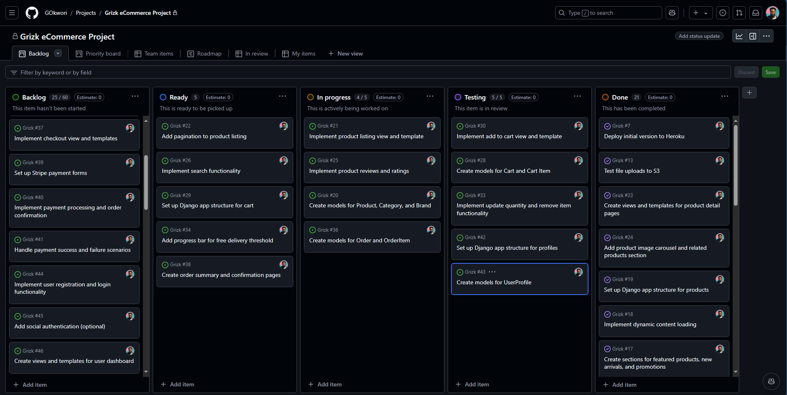
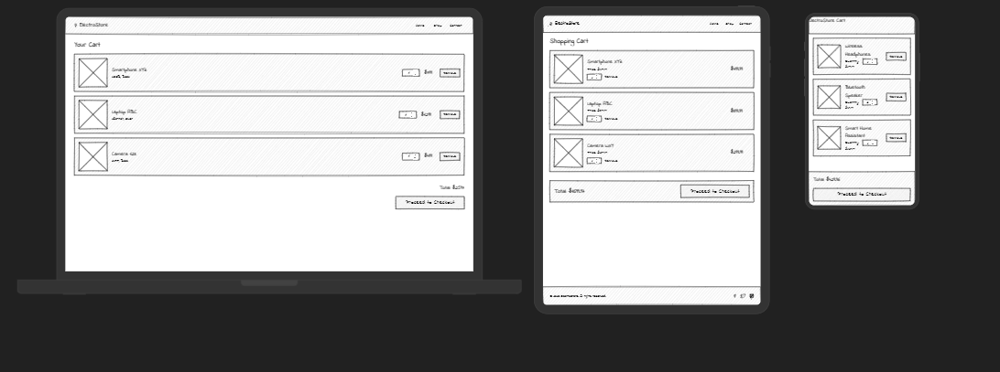
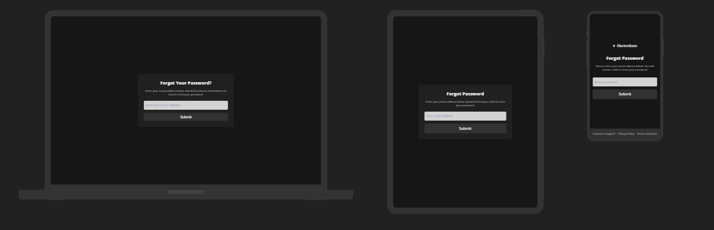

# Grizk


Visit the deployed site: [Grizk](https://ecommerce-grizk-2f04b3042fc5.herokuapp.com/)

## Introduction

Grizk is an e-commerce platform specializing in sophisticated, cutting-edge electronic gadgets designed for tech enthusiasts. Developed as a showcase of a modern and dynamic online store, Grizk offers a wide range of the latest tech products including smart devices, high-end electronics, and accessories, all curated to meet the needs of a digitally connected lifestyle. This project was built using Django, HTML, CSS, JavaScript, and Python as part of my Full Stack Software Development journey.

Grizk combines state-of-the-art technology with a seamless user experience, offering customers the ability to discover, explore, and purchase gadgets from leading brands. The platform integrates a variety of functionalities to enhance the shopping experience, including advanced product search, smooth navigation, and secure payment processing.

With technology evolving rapidly, there is an increasing demand for reliable and user-friendly platforms where consumers can purchase the latest electronics confidently. Grizk aims to address this need by providing a trusted, convenient, and efficient shopping experience for tech-savvy users. The platform highlights the newest releases, trending gadgets, and exclusive deals, making it a go-to destination for anyone looking to stay at the forefront of the tech world.

For testing purchases, you can use the following [Stripe Dummy Card](https://stripe.com/docs/testing) details:

- **`Success Card Number:`** 4242-4242-4242-4242
- **`Expiry Date:`** Any future date in MM/YY format
- **`CVV:`** Any 3-digit number
- **`Zip/Postcode:`** Any 5 numerals  

**Note:** Any payments made using a valid debit/credit card will not be processed, and no charges will be applied. Orders placed for testing purposes will not be fulfilled.

For full Admin access to the Django Admin panel, you can use the following link: [Grizk Admin](https://ecommerce-grizk-2f04b3042fc5.herokuapp.com/admin/)

To access the Admin Dashboard frontend view with relevant credentials, visit: [Grizk Admin Dashboard](https://ecommerce-grizk-2f04b3042fc5.herokuapp.com/products/admin_dashboard/)

AccountSphere empowers you to manage your financial workflows seamlessly in one integrated platform. Embrace smarter financial management today!


## Table of Contents

- [Grizk](#Grizk)
  - [Introduction](#introduction)
  - [Table of Contents](#table-of-contents)
  - [Overview](#overview)
  - [Customer Goals](#customer-goals)
  - [Business Goals](#business-goals)
- [UX/UI - User Experience/User Interface](#uxui---user-experienceuser-interface)
  - [Design Inspiration](#design-inspiration)
    - [colour Scheme](#colour-scheme)
    - [Typography \& Iconography](#typography--iconography)
- [Project Planning](#project-planning)
  - [Strategy Plane](#strategy-plane)
    - [Site Goals](#site-goals)
  - [Agile Methodologies](#agile-methodologies)
    - [MoSCoW Prioritization](#moscow-prioritization)
    - [Sprints](#sprints)
  - [Marketing](#marketing)
  - [User Stories](#user-stories)
    - [Visitor User Stories](#visitor-user-stories)
    - [Epic - Home View \& User Account](#epic---home-view--user-account)
    - [Epic - Products](#epic---products)
    - [Epic - Basket Management \& Purchasing](#epic---basket-management--purchasing)
    - [Epic - Wishlist](#epic---wishlist)
    - [Epic - Newsletter](#epic---newsletter)
  - [Scope Plane](#scope-plane)
  - [Structural Plane](#structural-plane)
  - [Skeleton \& Surface Planes](#skeleton--surface-planes)
    - [Wireframes](#wireframes)
    - [Database Schema](#database-schema)
    - [Defensive Design](#defensive-design)
- [Features](#features)
  - [User View - Guests/Account Holders](#user-view---guestsaccount-holders)
  - [CRUD Functionality](#crud-functionality)
  - [Features Showcase](#features-showcase)
  - [Future Features](#future-features)
- [Technologies \& Languages Used](#technologies--languages-used)
  - [Libraries \& Frameworks](#libraries--frameworks)
  - [Tools \& Programs](#tools--programs)
- [Testing](#testing)
- [Deployment](#deployment)
  - [Connecting to GitHub](#connecting-to-github)
  - [Django Project SetUp](#django-project-setup)
    - [Elephant SQL](#elephant-sql)
  - [Heroku Deployment](#heroku-deployment)
  - [Google Mail Setup](#google-mail-setup)
  - [AWS Config](#aws-config)
    - [Media Folder Setup](#media-folder-setup)
    - [Django AWS Connect](#django-aws-connect)
  - [Stripe Config](#stripe-config)
  - [Clone Project](#clone-project)
  - [Fork Project](#fork-project)
- [Credits](#credits)
  - [Code](#code)
  - [Media](#media)
    - [Additional reading/tutorials/books/blogs](#additional-readingtutorialsbooksblogs)
  - [Acknowledgements](#acknowledgements)


## Overview

Grizk is a cutting-edge electronics store that specializes in providing the latest tech gadgets and sophisticated devices to meet the needs of modern consumers. With a focus on quality and innovation, Grizk brings together a curated selection of electronics from top brands, ranging from smart home devices and mobile accessories to the latest laptops and wearables. Users on Grizk are invited to:

- Explore the store as Guests, with full browsing capabilities
- Register for an Account to access enhanced features
- Utilize the Wishlist to save and track favorite products
- Browse products by category, brand, and price to find the perfect gadget
- Add products to their cart, edit quantities, and proceed to a secure checkout
- As registered users, view their order history and track past purchases
- Subscribe to weekly newsletters for updates on new releases, exclusive deals, and tech news

Grizk is designed to be fully accessible across all modern browsers and is optimized for a seamless experience on different screen sizes, ensuring that users can browse and shop effortlessly whether on desktop, tablet, or mobile devices. With a sleek, intuitive interface, Grizk makes it easy for users to find and purchase the best electronics on the market.

## Customer Goals

Grizk aims to provide a streamlined, intuitive shopping experience that caters to tech enthusiasts of all levels. Customers can easily discover the latest gadgets, compare products, and make informed decisions based on detailed descriptions, specifications, and user reviews. It is anticipated that customers will create accounts on Grizk to take full advantage of features such as wishlist management, faster checkouts, and order tracking. Grizk also encourages customers to stay informed and engaged with tech trends through its regular newsletters, which offer insights into the latest products, promotions, and tech news.

By focusing on quality and user experience, Grizk strives to build trust and loyalty among its customers, making it a go-to destination for anyone looking to keep up with the latest in tech innovation.

## Business Goals

Grizk provides robust and user-friendly administrative functionality for the business owner through an accessible, easy-to-navigate Admin Dashboard. The dashboard simplifies inventory management, order processing, and customer service, allowing admins to make quick and efficient updates to product listings, track orders, and manage customer queries. Additional frontend forms enable seamless content management, including the ability to add, edit, and remove product listings and articles.

Grizk's goal is to establish a solid base of repeat customers who seek reliable, cutting-edge technology from trusted brands. The platform is designed to scale with the business, supporting ongoing growth and new feature development. Marketing efforts, such as targeted social media campaigns, email newsletters, and blog content, help to raise brand awareness and attract new users, driving continued engagement and sales. With a focus on innovation, quality, and customer satisfaction, Grizk aims to be a leader in the competitive world of electronics e-commerce.


## UX/UI - User Experience/User Interface

### `Design Inspiration`

Grizk’s design captures the essence of modern tech elegance, leveraging a sleek, dark-themed aesthetic that echoes sophistication and innovation. The primary colour scheme revolves around jet black (`#000`) as the background, paired with striking orange-red (`#ff4500`) accents, symbolizing energy and cutting-edge technology. This colour combination is not only visually appealing but also enhances the readability and focus of the content across all devices.

The site maintains a responsive design, ensuring that users on mobile, tablet, and desktop can seamlessly navigate through Grizk’s interface. Key visual elements such as buttons, icons, and product cards are intuitively designed to stand out against the dark background, ensuring that users can quickly identify interactive components.

A minimalist logo, designed using [LogoAI](https://www.logoai.com), is prominently displayed as the favicon and brand signature across the site. The logo’s clean lines and bold colours reinforce the store’s identity as a go-to destination for high-tech enthusiasts.

  
*Grizk logo*

### `Dark Theme with Electric Accents`

The dark-themed design, with a solid black background, was chosen not only for its sleek, high-tech appearance but also to provide a comfortable, strain-free experience for users browsing for extended periods. Orange-red highlights are strategically used to emphasize calls to action, such as "Add to Cart" and "Checkout," ensuring these elements are easily noticeable.

Buttons across the site feature a smooth hover effect where the colours invert — from black with red accents to a red background with black text. This visual feedback enhances user interactions and draws attention to clickable elements.

### `Header & Navigation`

The header employs a radial gradient (`#220202` to `#000000`), giving a subtle, polished look that matches the dark theme. Navigation elements are styled with bold, orange-red text that is easy to read and aligns with the overall visual consistency. 

The navigation bar remains sticky across all screens, ensuring users can access essential sections such as the cart, profile, and categories without scrolling back up. For a seamless experience, dropdown menus and off-canvas sections (for wishlist and cart) match the site’s dark theme and accent colours, providing a unified visual presentation.

  
*Intuitive header and navigation for streamlined browsing*

### `Footer Design`

The footer continues the radial gradient design, providing a cohesive finish to each page. It features social media icons that subtly increase in size when hovered over, inviting users to connect without overwhelming the screen. Subscription forms are embedded within bordered panels, elegantly styled with orange-red outlines that stand out against the dark background, encouraging users to engage with newsletters and updates.

  
*Footer with gradient design and intuitive social icons*

### `Product Showcase & Visual Feedback`

Product images are displayed in a clean, distraction-free layout to ensure the gadgets are the center of attention. Each product card is designed to hover slightly when interacted with, giving a sense of depth and enhancing the overall user experience. The site employs a flexbox grid system to arrange products dynamically, ensuring consistency across varying screen sizes.

Visual feedback is implemented throughout the interface, including subtle animations and hover effects. For example, toasts pop up on the right side of the screen to confirm actions like adding items to the cart or removing products from the wishlist, ensuring users are always informed.

### `Dual Carousel Implementation`

#### Home Page Carousel (Landing)

Upon entering the Grizk site, users are greeted by a captivating carousel on the homepage. This landing carousel showcases the latest promotions, featured products, and exclusive offers. Each slide features high-resolution product images, a brief description, and a prominent call-to-action button ("Explore Now), styled with the site's signature colours. 

The carousel uses smooth slide transitions (`transform 0.3s ease-in-out`) to create an engaging browsing experience. Users can navigate through slides using intuitive swipe gestures on mobile devices or click through arrows on desktops. The design ensures a seamless, immersive first impression, setting the tone for a sophisticated shopping journey.

#### Top Deals Carousel

Further down on the homepage, a secondary carousel highlights top deals, seasonal promotions, and special offers. This section follows a similar design but emphasizes discounts and limited-time offers. Each product card within the carousel is designed to slightly enlarge on hover (`scale(1.05)`), giving a sense of interactivity and depth. The hover effect draws users' attention to these key deals, encouraging exploration.

Both carousels adapt seamlessly across devices, ensuring consistent viewing experiences whether on mobile or desktop. Image resizing and responsive text adjustments allow for clear, legible content presentation without compromising aesthetics.

  
*Dynamic carousels engaging users with key offers*

  
*Visually engaging carousel showcasing top deals*

### `Cart & Wishlist Off-Canvas Design`

#### Off-Canvas Cart

Grizk introduces an off-canvas cart feature that slides in from the side of the screen when activated. This allows users to quickly view and manage their cart items without leaving the current page. 

The cart's design follows the dark theme, with the bright accent colours ensuring important details like item names, quantities, and prices stand out. Buttons to "Checkout" and "Continue Shopping" invert colours on hover, providing immediate feedback to user actions. Each product listed has quantity adjustment controls and a "Remove" button, giving users full control over their purchases.

#### Off-Canvas Wishlist

The off-canvas wishlist functions similarly to the cart, enabling users to save products for later. This panel slides in smoothly, showing all saved products with options to add them to the cart or remove them from the wishlist. The same dark colour scheme and accent colours maintain consistency, ensuring users know they are still within the Grizk environment.

Both off-canvas panels are designed to be responsive, adjusting seamlessly to smaller screens. Controls are adequately spaced, and scrollbars appear as needed, ensuring smooth navigation and usability.

  
*Seamlessly integrated off-canvas panels for cart and wishlist*


### `Responsive Design & Media Queries`

Grizk’s design is fully responsive, utilizing media queries to adapt layouts for different devices. For instance, elements adjust seamlessly between mobile views (`max-width: 320px`) and larger desktops (`min-width: 1801px`), ensuring a smooth and consistent experience. Features like dropdowns, carousels, and off-canvas components scale appropriately, providing intuitive navigation and user interaction across all platforms.


|  |  | | | 
| --- | --- | --- | --- | 
| |  |  |  |
| |  |  |  |

*Consistent, responsive design for all screen sizes*

###  `Animations & Transitions`

Animations are carefully integrated to enhance user interaction without detracting from the browsing experience. For instance, product images gently enlarge on hover (`scale(1.05)`) to draw focus, while buttons smoothly change colour on hover, indicating interactivity. This provides a polished, fluid user experience that aligns with Grizk’s futuristic aesthetic.

Grizk is designed not just as an e-commerce platform but as a digital shopping experience that embodies the sophistication of the tech products it offers. Through thoughtful design, intuitive navigation, and responsive elements, Grizk ensures users are fully engaged from browsing to checkout, no matter their device.

### `Colour Scheme`

  
*Grizk colour Scheme*

Grizk employs a bold, modern colour palette that emphasizes contrast and clarity, essential for an electronics e-commerce platform. The CSS uses well-defined variables to ensure consistency across the site:

- `--electric-orange`: #ff4500;
- `--deep-black`: #000;
- `--midnight-maroon`: #220202;
- `--soft-gray`: #22223b;
- `--vivid-white`: #fff;
- `--steel-gray`: #aab7c4;
- `--bright-yellow`: #ffc824;

These colours were chosen to provide a sleek, high-tech aesthetic that appeals to tech enthusiasts. The primary colour, `electric-orange` (#ff4500), serves as a bright accent used throughout the site, from call-to-action buttons to hyperlinks and notifications. It ensures that essential elements stand out against the dark, muted backgrounds, guiding users' attention seamlessly. 

#### Primary and Accent colours

The `deep-black` (#000) background delivers a sophisticated, minimalist canvas, allowing the `electric-orange` to shine as the main accent colour. This vibrant hue is featured prominently on buttons, interactive elements, and hover effects, ensuring that users can intuitively navigate the site. A touch of `midnight-maroon` (#220202) adds depth and warmth, subtly incorporated in background gradients and header elements to break up the dark theme without overwhelming the user.

#### Button and Interactive Elements

Interactive elements on Grizk, such as buttons and clickable links, employ a striking colour contrast. The standard button style features a `black` background with `electric-orange` borders and text, creating a dynamic, eye-catching appearance. On hover, the colours invert—buttons light up in `electric-orange` while the text turns `black`. This creates a clear, responsive visual cue, enhancing the user’s experience and interaction with the site.

  
*Grizk Main Button Design*

#### Consistency and Feedback Mechanisms

Grizk utilizes `soft-gray` (#22223b) for secondary backgrounds, borders, and certain text elements to maintain visual balance. When users interact with fields or buttons, a `bright-yellow` (#ffc824) or `electric-orange` appears to provide immediate feedback, confirming the action is available or complete. This approach simplifies navigation, making it easy for users to understand where they are on the site and how they can interact with it.

#### Accessibility and Contrast Testing

Colour accessibility is a priority for Grizk. Using [Adobe colour](https://colour.adobe.com/create/colour-accessibility), Iensured that all primary text and essential visual elements meet or exceed WCAG 2.1 guidelines for contrast. This makes the site accessible to users with visual impairments. Below are examples of how these tests were conducted to guarantee clarity and usability:

  
*Grizk colour Accessibility Check*

#### Button Contrast

Buttons were rigorously tested to ensure that they are easy to see and interact with on both desktop and mobile devices. colour contrasts between the `electric-orange` and background hues ensure that buttons remain legible under various lighting conditions. This helps prevent misclicks and guides users smoothly through their shopping experience.


### `Typography & Iconography`

  
*Grizk Font Pairing*

For Grizk, typography was chosen to convey a sense of modernity, precision, and clarity, essential for an electronics e-commerce platform where users need to quickly grasp product information. The primary typeface used is **Roboto**. 

**Roboto** serves as the main sans-serif font, providing a sleek, modern, and easily readable style that aligns with the brand's high-tech image. It is used extensively for titles, headings, and important labels across the platform, ensuring content is presented clearly and prominently. On the other hand, **Fira Code**, a monospaced font, was chosen for product details and specifications, emphasizing the technical aspects of the electronics listed on the site. This combination provides a robust contrast that enhances the readability and structure of the content, improving the overall user experience.

### `Iconography`

Grizk's iconography complements its clean, modern aesthetic, using simple, clear icons from the **Font Awesome** library. Icons are employed strategically to guide users through their journey on the site—whether it’s adding products to the cart, favoriting items, or navigating different categories. For example, the shopping cart, wishlist heart, and user account icons are immediately recognizable and provide visual cues to users, enhancing their navigation experience.


## Project Planning

### `Strategy Plane`

The primary objective for **Grizk** was to develop a sophisticated e-commerce platform specializing in cutting-edge tech gadgets. The goal was to ensure a seamless, intuitive, and enjoyable shopping experience, reflecting Grizk's identity as a modern, user-centric electronics store. The platform needed to be fully responsive, offering a consistent experience across all devices, while integrating advanced features such as secure payment systems, intuitive navigation, and personalization options.

Grizk was built to meet the following core goals:

#### Site Goals
- **Responsive Design:** Ensure the platform is accessible across all devices, including desktops, tablets, and mobile phones. Users should have a fluid and consistent shopping experience, no matter where they access the site from.
- **User Authentication:** Provide secure and reliable login and registration options for customers, with the ability to save items to a wishlist, view past orders, and receive personalized recommendations.
- **Guest Access:** Allow guests to browse, explore products, and add items to the cart without requiring them to register, simplifying the user journey for first-time visitors.
- **Seamless Checkout:** Utilize **Stripe** as the primary payment gateway, ensuring secure and efficient transactions. The checkout process should be straightforward, with clear feedback and confirmation at each step.
- **Advanced Product Management:** Feature a robust backend for inventory management, enabling easy updates to product details, categories, and availability. 
- **Wishlist & Off-Canvas Panels:** Provide customers with the ability to save their favorite products and access them quickly via intuitive off-canvas panels for easy viewing and management.
- **Integrated Marketing Tools:** Implement features like newsletter subscriptions, personalized recommendations, and SEO-friendly content to drive engagement and improve visibility on search engines.
- **Engaging UI/UX Design:** Design a visually appealing and easy-to-navigate site, with consistent branding elements, to build trust and make the shopping experience enjoyable.
- **Enhanced Security & User Privacy:** Secure user data through encryption and adhere to the best practices in cybersecurity, ensuring that customers can shop with confidence.

#### Development Approach

The design and visual assets of the website were curated and created to convey a sleek, modern feel, emphasizing Grizk's commitment to delivering high-quality tech gadgets. **Figma** was utilized to design the initial wireframes and prototypes, ensuring a cohesive design language across all pages and features. The hero images, promotional banners, and product showcases were designed to be visually striking, grabbing the user's attention while maintaining brand consistency.

During the development phase, **Bootstrap** was employed to streamline the responsive design process, while custom **CSS** was used to enhance the visual appeal and interactivity of elements such as buttons, modals, and toast notifications. To maintain uniformity, CSS variables were defined for colors, fonts, and component properties, enabling rapid updates and scaling.

#### Key Features Implemented

1. **User-Centric Feedback & Toast Notifications**
   - Users receive immediate feedback during interactions, such as adding items to the cart, completing a purchase, or updating account information. This was achieved using visually distinct toast notifications that match Grizk's color scheme, ensuring clarity and consistency across the site.

2. **Secure Payment Integration with Stripe**
   - Stripe's robust and reliable payment processing was integrated to ensure secure, efficient transactions. Clear visual indicators and confirmations guide the user through the checkout, minimizing friction and improving trust.

3. **Visual Appeal Through Cohesive Branding**
   - Grizk's brand identity is consistently reflected throughout the site using carefully chosen font, color schemes, and iconography. This approach fosters brand recognition and enhances user engagement, as customers can easily associate the visual style with quality and reliability.

4. **Dynamic Off-Canvas Panels for Cart & Wishlist**
   - The off-canvas panels allow users to easily manage their cart and wishlist items without disrupting their browsing experience. These panels slide in smoothly, offering quick access to item details, quantity controls, and direct links to proceed to checkout.

#### Future Development & Expansion
- **AI-Powered Product Recommendations:** Plans to integrate machine learning algorithms to provide tailored product suggestions based on user behavior and preferences.
- **Interactive 3D Product Views:** Enable customers to view products in a more engaging, interactive format, offering 360-degree visualizations.
- **Enhanced Marketing Integration:** Further development of marketing tools, including dynamic newsletters, limited-time offers, and seasonal promotions, to drive engagement and sales.
- **Multi-Language Support:** Expand accessibility by offering the site in multiple languages, catering to a broader, global audience.

Grizk was developed with scalability and flexibility in mind, ensuring that future enhancements and features can be seamlessly integrated. With a solid foundation in place, Grizk aims to set the standard for tech e-commerce, providing an unmatched user experience that caters to both tech enthusiasts and casual shoppers alike.


### `Agile Methodologies`

Grizk was developed using Agile planning methodologies, ensuring a structured, iterative approach to building the platform. Leveraging tools like **[GitHub Projects](https://github.com/)**, the development process was organized around Epics, Milestones, and Sprints, allowing for efficient tracking of tasks and priorities. Using GitHub’s issue boards, each task was clearly defined, labeled, and assigned to specific sprints. This setup streamlined the workflow, enabling focused development phases and reducing potential errors.

#### MoSCoW Prioritization

To effectively manage feature development and prioritize tasks, the MoSCoW Prioritization method was adopted for Grizk, which helped categorize the project components as follows:

- **Must Haves**: Essential and critical elements that were non-negotiable. These formed the core functionalities of the project and were vital for achieving the MVP (Minimum Viable Product). For Grizk, this included secure authentication, seamless checkout, and responsive product browsing.
- **Should Haves**: Important features that added value to the overall platform but were not critical for the MVP launch. These were addressed after the 'Must Haves' were implemented, such as the Wishlist and enhanced search filtering.
- **Could Haves**: Desirable enhancements that would improve the user experience or functionality but were not essential. These were considered bonuses and were planned only if time permitted after core features were completed. Examples included custom animations, advanced filters, and social sharing options.
- **Won't Haves**: Features that were deemed unnecessary for the current project scope or release. These were either postponed for future iterations or discarded entirely to maintain focus on core functionalities.

#### Sprints

The development process was divided into well-defined **Sprints**, each focusing on specific areas of the Grizk platform. This helped maintain momentum and allowed for incremental progress with clear milestones. The flexibility of Agile allowed for adjustments in the scope and tasks as the project evolved, ensuring that key features were prioritized and integrated effectively.

  
*Grizk Sprint Board*


| Sprint No. | Sprint Content                               | Start/Finish Dates      |
|------------|---------------------------------------------|-------------------------|
| #1         | **Project Setup**: Initial setup, repo configuration, base framework installations, and environment preparation. | 01/07/24 - 10/07/24     |
| #2         | **User Authentication & Navigation**: Implemented secure user login, registration, and navigation structure. | 11/07/24 - 20/07/24     |
| #3         | **Product Management & CRUD Operations**: Developed product listing, adding, updating, and deletion capabilities. | 21/07/24 - 30/07/24     |
| #4         | **Shopping Cart Functionality**: Added cart system with item additions, removals, and quantity management. Styling for responsive design. | 31/07/24 - 10/08/24     |
| #5         | **Wishlist Feature**: Integrated wishlist with off-canvas display for easy management of saved items. | 11/08/24 - 15/08/24     |
| #6         | **Product Details & Carousel Implementation**: Enhanced product detail views and added carousel elements on the homepage. | 16/08/24 - 20/08/24     |
| #7         | **Admin Dashboard & Inventory Management**: Designed and implemented an intuitive admin interface for inventory control. | 21/08/24 - 25/08/24     |
| #8         | **User Notifications & Correspondence**: Integrated email notifications, toasts, and order confirmations for enhanced user engagement. | 26/08/24 - 05/09/24     |
| #9         | **Documentation, Testing & Final Touches**: Comprehensive testing, bug fixing, and documentation preparation for final delivery. | 06/09/24 - 23/10/24     |

#### Agile Advantages

Using Agile methodology ensured that development was **iterative** and **adaptive**, allowing for frequent feedback loops and early problem detection. Each sprint concluded with a review phase, where the functionalities were tested, refined, and polished. This approach ensured a robust, user-focused platform at the end of the development cycle, meeting the high standards set for Grizk.

- **Efficient Collaboration**: Regular updates, stand-ups, and meetings enabled smooth communication between team members, making sure everyone was aligned on goals and priorities.
- **Quick Adaptation to Changes**: If a new feature or adjustment was deemed necessary during the development phase, the Agile framework allowed for rapid incorporation, ensuring Grizk remained up-to-date with user needs and market trends.
- **Scalability**: The modular approach adopted in Agile sprints made it easier to scale and build upon Grizk’s initial features, paving the way for future enhancements without disrupting the core structure.


### `User Stories`

User stories and features were documented and managed on [GitHub Projects](https://github.com).

#### Visitor User Stories

| User Story | Priority |
|------------|----------|
| As a **customer**, I can **view the site's home page** so that I can **understand Grizk's mission and explore the tech gadgets it offers.** | **MUST HAVE** |
| As a **customer**, I can **see and use the navigation bar** so that I can **easily navigate through different categories and features of the site.** | **MUST HAVE** |
| As a **customer**, I can **enter keywords into the search bar** so that I can **quickly find a specific gadget or product.** | **MUST HAVE** |

#### Epic - Home View & User Account

| User Story | Priority |
|------------|----------|
| As a **customer**, I can **create and manage an account with Grizk** so that I can **store my personal details, order history, and streamline my checkout experience.** | **MUST HAVE** |
| As a **customer**, I can **edit my account details** so that I can **ensure my information is always accurate and up-to-date.** | **MUST HAVE** |
| As a **user**, I can **enter my login details** so that I can **access my account and saved preferences on Grizk.** | **MUST HAVE** |
| As a **user**, I can **click on visible links in the footer** so that I can **easily access important information like FAQs, Contact, and Policies.** | **MUST HAVE** |
| As a **user**, I can **register my email and receive a verification link** so that I can **create a secure account on Grizk.** | **SHOULD HAVE** |
| As a **customer**, I can **use the Contact Us form** so that I can **get in touch with Grizk's support for inquiries or assistance.** | **SHOULD HAVE** |

#### Epic - Products

| User Story | Priority |
|------------|----------|
| As a **user**, I can **filter and sort products on the 'All Products' page** so that I can **refine my search and shop more efficiently.** | **MUST HAVE** |
| As a **user**, I can **click on a specific category in the navbar** so that I can **view products grouped by their type, brand, or features.** | **MUST HAVE** |
| As a **customer**, I can **click on an individual product** so that I can **view detailed information such as specs, price, and available options.** | **MUST HAVE** |
| As a **site admin**, I can **add new products via a frontend form** so that I can **expand Grizk's product range without complex backend operations.** | **MUST HAVE** |
| As a **site admin**, I can **edit existing product information** so that I can **keep product details current and accurate.** | **MUST HAVE** |
| As a **site admin**, I can **delete products from the inventory** so that I can **remove discontinued or outdated products from the store.** | **MUST HAVE** |

#### Epic - Cart Management & Checkout

| User Story | Priority |
|------------|----------|
| As a **customer**, I can **easily add items to my cart from the product page** so that I can **prepare for checkout without navigating away.** | **MUST HAVE** |
| As a **customer**, I can **adjust the quantity or remove items directly from the cart** so that I can **have full control over what I'm purchasing.** | **MUST HAVE** |
| As a **customer**, I can **view my cart total and itemized list from any page** so that I can **track my spending at all times.** | **MUST HAVE** |
| As a **customer**, I can **securely checkout and complete my purchase** so that I can **have a seamless payment experience.** | **MUST HAVE** |
| As a **customer**, I can **receive a confirmation email with my order details** so that I can **keep a record of my purchase.** | **MUST HAVE** |
| As a **site user**, I can **view customized error pages with 'Home' links** so that I can **easily navigate back if a page is not available or requires login.** | **MUST HAVE** |

#### Epic - Wishlist

| User Story | Priority |
|------------|----------|
| As a **logged-in user**, I can **add products to a wishlist** so that I can **save items I'm interested in for future purchase.** | **COULD HAVE** |
| As a **logged-in user**, I can **remove items from my wishlist** so that I can **keep my list relevant and organized.** | **COULD HAVE** |

#### Epic - Promotions & Deals

| User Story | Priority |
|------------|----------|
| As a **customer**, I can **see promotional banners and deals on the homepage carousel** so that I can **take advantage of special offers and discounts.** | **MUST HAVE** |
| As a **site admin**, I can **update deals and promotional content** so that I can **manage campaigns and highlight specific products.** | **SHOULD HAVE** |

#### Epic - Newsletter

| User Story | Priority |
|------------|----------|
| As a **customer**, I can **subscribe to Grizk's newsletter** so that I can **receive updates on the latest tech gadgets, sales, and exclusive offers.** | **SHOULD HAVE** |
| As a **customer**, I can **enter my email into the newsletter form** so I can **stay informed on the latest tech trends and innovations.** | **SHOULD HAVE** |
| As a **site admin**, I can **manage newsletter subscriptions** so that I can **engage with users and promote Grizk's community.** | **SHOULD HAVE** |

#### Epic - Blog Management & Engagement

| User Story | Priority |
|------------|----------|
| As a **site visitor**, I can **browse through the blog section** so that I can **read articles and stay informed on various topics.** | **MUST HAVE** |
| As a **customer**, I can **read blog posts on different tech topics** so that I can **gain insights, learn about new products, and engage with the content.** | **MUST HAVE** |
| As a **site visitor**, I can **search for specific blog posts** so that I can **easily find articles related to my interests.** | **SHOULD HAVE** |
| As a **customer**, I can **share blog posts on social media** so that I can **promote interesting content and engage with my social circle.** | **COULD HAVE** |
| As a **site admin**, I can **create, edit, and publish blog posts** so that I can **share updates, insights, and promotional content with readers.** | **MUST HAVE** |
| As a **site admin**, I can **upload images to blog posts** so that I can **enhance articles visually and make them more engaging.** | **SHOULD HAVE** |
| As a **site admin**, I can **categorize blog posts** so that I can **organize content and improve user navigation.** | **SHOULD HAVE** |
| As a **site admin**, I can **manage comments on blog posts** so that I can **moderate discussions and ensure a positive community experience.** | **COULD HAVE** |
| As a **site admin**, I can **view metrics and analytics for blog posts** so that I can **understand which content is performing well and adjust strategies accordingly.** | **COULD HAVE** |
| As a **customer**, I can **leave comments on blog posts** so that I can **engage in discussions and share my thoughts on the topics.** | **SHOULD HAVE** |
| As a **customer**, I can **subscribe to receive updates for new blog posts** so that I can **stay informed about the latest content published on the site.** | **COULD HAVE** |


### `Scope Plane`

The development of **Grizk** was centered around creating a smooth and engaging shopping experience for tech enthusiasts, while also building on advanced e-commerce functionalities, such as integrating with payment systems and providing enhanced user management features. The scope was carefully defined to focus on essential elements of a functional online electronics store, while also allowing room for innovative features that set Grizk apart.

The primary goal was to deliver a fully operational e-commerce platform that could handle user accounts, secure payments, product management, and smooth checkout processes. Through the strategic planning process, the project scope expanded to include additional features aimed at enhancing user engagement and supporting the overall shopping experience.

#### Core Focus: Streamlined User Experience & Stripe Integration

While maintaining the core functionality of a working e-commerce platform, the Grizk project was also an opportunity to learn and master the **Stripe API** and **webhook handlers** to manage payments seamlessly. The integration of Stripe was a focal point, ensuring that transactions were smooth, secure, and reliable. The project’s scope was managed to prioritize essential functionality, guaranteeing the successful delivery of the MVP (Minimum Viable Product).

#### Feature Expansion: Pushing Boundaries Beyond the Basics

While planning, it became clear that Grizk could further innovate by adopting themes and features not typically seen in standard e-commerce projects. For instance, introducing a **Wishlist** feature allowed customers to save higher-priced items and come back to them later, understanding that premium tech gadgets often have a higher price point.

With a clean and efficient **Django MVT (Model-View-Template)** architecture, it was possible to develop these features quickly. The addition of an **Admin frontend panel** ensured that product and article management could be done efficiently, enabling the business to start accepting orders immediately.

#### Essential Features Implemented

- **User Account Management:** 
  - Seamless account creation and management using **Django AllAuth** to simplify authentication, secure login, and user profile management.
  
- **Payment Integration:**
  - Integration of a **secure and reliable payment system via Stripe**, including payment processing, invoice generation, and refund handling, with webhook integration for real-time updates.

- **Product Inventory Management:**
  - Full **CRUD (Create, Read, Update, Delete)** operations for product management, enabling admins to manage inventory efficiently.

- **Wishlist Feature:**
  - Users can **save products to a Wishlist**, allowing them to bookmark items for future purchases. This feature is especially beneficial for high-value tech gadgets that may require consideration before purchase.

- **Shopping Experience with Cart and Checkout:**
  - Users can easily **add items to their cart, view a summary of their order, and proceed through a streamlined checkout process**. Ensuring that the purchase experience is intuitive and seamless was a key aspect of Grizk’s scope.

- **Responsive Design:**
  - The site was built to be **fully responsive**, offering an optimal browsing experience across all device types, from desktops to mobile phones.

- **Detailed Business Information:**
  - Inclusion of comprehensive **business details and policies**, helping customers make informed purchases and understand terms and conditions.


### `Structural Plane`

Grizk's development was rooted in a solid structural framework, utilizing **custom CSS** combined with **Bootstrap 5** for a seamless and responsive user experience. The project started with the foundational structure provided by **Code Institute's Boutique Ado e-commerce project**, which served as a base. However, significant customization and enhancements were made to align with Grizk's vision of a modern and streamlined tech gadget marketplace. This approach allowed Grizk to retain reliable, core e-commerce functionalities while delivering a unique and engaging user interface.

#### Core Framework & Customization

Built upon **Bootstrap 5**, Grizk leverages the powerful grid system and pre-built components to deliver a responsive, mobile-first design. Given that many users shop on their mobile devices, Grizk prioritizes smooth transitions across screen sizes, ensuring a consistent and fluid experience whether users are on desktops, tablets, or smartphones.

Grizk's structure benefited greatly from adopting **Code Institute’s Boutique Ado walkthrough project**. This foundation was picked apart, restructured, and extensively customized to suit Grizk’s brand identity and e-commerce needs:
- **Simplified Navbar:** Inspired by the modern e-commerce experience, the default Bootstrap navbar was reworked to provide a cleaner, more intuitive navigation. 
- **Responsive Icons & Graphics:** Icons were carefully selected from **Fontawesome** during the wireframing process in **Uizard**, enhancing the overall visual experience. Grizk's branding, including the logo, is consistent across the site, used as a favicon and integrated into marketing materials such as newsletters.

#### Form Styling & UX Enhancements

Form elements throughout Grizk were customized to enhance user experience:
- **Custom Input Borders:** Instead of the default blue highlight seen in many browsers, form fields now feature a **2px solid red-orange border**, consistent with Grizk's primary color scheme. This change ensures that every element remains on-brand, even during user interactions.
- **Form Validation:** Validation styles were adapted to ensure clarity and simplicity, making error messages easily noticeable without overwhelming the design. Input fields provide immediate visual feedback, ensuring users know exactly where corrections are needed.

#### Advanced Layout Components

Grizk integrates advanced components to elevate the shopping experience:
- **Integrated Carousels:** The home page landing features a dynamic **auto-rotating carousel** that showcases new arrivals, top-rated gadgets, and promotions. Additionally, a dedicated **carousel for Top Deals** offers quick browsing of discounted products, helping users discover great deals. These carousels, built using Bootstrap components, were enhanced with smoother animations for a sleek visual effect.
- **Offcanvas Cart & Wishlist:** Grizk includes **offcanvas panels** for the cart and wishlist, enabling users to manage their items without leaving the current page. Users can easily add, edit, or remove items, providing a streamlined, uninterrupted shopping journey.

#### Typography & Readability

Typography choices were carefully selected to ensure readability across all devices:
- Grizk uses a blend of **Roboto** fonts for clean, modern text presentation. Typography plays a vital role in maintaining the professional and polished look of Grizk, enhancing user experience by clearly displaying product descriptions, features, and essential information.
- Text hierarchies guide users naturally through headlines, product details, and calls to action, helping to ensure a seamless browsing and purchasing experience.

#### Grid Layouts & Flexibility

The **Bootstrap grid system** enabled effortless layout adjustments, ensuring the design remains responsive and adaptable to different screen sizes and resolutions. Specific features include:
- **Product Grid Layouts:** Products are displayed in a **dynamic grid view** that adjusts according to screen size. On larger screens, more items are displayed per row, while smaller devices show a condensed view, ensuring that product details remain prominent.
- **Footer Accordion Sections:** To maintain a clean design, the footer uses accordion panels to organize FAQs, support links, and quick navigation. This keeps content accessible without overwhelming the visual flow.

#### Enhancing User Interactions with Bootstrap Components

Grizk's user interface benefits from Bootstrap's array of interactive elements:
- **Accordion Panels:** These are used for FAQs, support information, and other expandable content, keeping the interface clean while ensuring users can quickly access additional details.
- **Toasts & Modals:** **Toast notifications** provide users with real-time feedback on their actions, such as adding items to the cart or completing a purchase. **Modals** simplify user interactions for tasks like login, registration, and quick product views, ensuring smooth and efficient navigation.

#### Adopting Code Institute's Boutique Ado Project

Leveraging **Code Institute’s Boutique Ado project** as a starting point provided a reliable structure for Grizk. This walkthrough project ensured that essential e-commerce functionalities were implemented effectively, including payment processing, user authentication, and product management. From this solid base, Grizk expanded with extensive customizations, ensuring that the final product not only met but exceeded modern e-commerce standards.

### `Skeleton & Surface Planes`

#### Wireframes

[Uizard](https://app.uizard.io) was instrumental in the design planning phase for Grizk, providing a seamless and intuitive way to create and adjust wireframes for different devices. From the outset, Grizk was envisioned as a sophisticated e-commerce platform for tech enthusiasts, and Uizard helped bring this vision to life. The ability to design across **desktop, tablet, and mobile** layouts ensured that Grizk offers a consistent and responsive experience across all devices. 

With Uizard's extensive plugin ecosystem, it was easy to incorporate icons and other design elements that match Grizk's sleek, modern aesthetic. Below are some of the wireframes that guided the development process, showcasing the layout and structure of key pages on different devices:

| Page | Wireframe | Mock-up | 
| -- | -- | -- | 
| Home Page|  |  | 
| Product Page | |  |
| Product Detail Page | |  |
| Product Page | |  |
| Cart Page | |  |
| Checkout Page | |  |
| Checkout Success Page | |  |
| Admin Page | |  |
| Authentication Page | |  |
| Registration Page | |  |
| Forgot Password Page | |  |
| Profiles Page | |  |


These wireframes provided a blueprint for Grizk’s development, ensuring the design remained user-centric and intuitive. By visualizing the layout, interactions, and content early in the process, Icould make necessary adjustments that contributed to a smooth and visually appealing final product.

#### Database Schema

  
*Database Schema (ERD) for Grizk illustrating the relationships between key components stored in the database*

The database schema for Grizk was designed using [DrawSQL](https://drawsql.app/), a versatile tool for creating ERDs (Entity Relationship Diagrams). The structure emphasizes a robust yet flexible framework to accommodate various features essential for a sophisticated e-commerce platform. The schema was inspired by Code Institute's Boutique Ado project but has been extensively customized to fit Grizk's unique features and requirements. Key models include:

- **User**: This model handles all aspects of user authentication and management, enabling account creation, login, and profile management. The model incorporates secure password storage and fields for managing user roles, such as administrators or regular customers.

- **UserProfile**: Extends user management by allowing users to store additional details such as default address, contact number, and country. This helps streamline the checkout process by autofilling user information.

- **Products**: The **Product** model encompasses attributes like `name`, `description`, `price`, `category`, `rating`, and `image`. It ensures that each tech gadget can be listed with detailed information, offering users an in-depth view of each product. The schema also supports product categories, allowing customers to filter and sort products seamlessly.

- **Category**: This model categorizes products, enabling users to browse items by tech segments like smartphones, laptops, accessories, etc. It simplifies navigation and allows admins to organize inventory effectively.

- **Order**: Each **Order** is linked to a user and records essential purchase details such as `full_name`, `email`, `shipping_address`, and `grand_total`. This model captures the flow of purchasing, from selecting items in the cart to confirming the order and processing payments. Fields like `order_reference` and `delivery_cost` ensure clear order tracking and seamless management.

- **OrderLineItem**: Connects specific products to an order, detailing the quantity, individual product attributes (like size or color), and line total. This model supports granular tracking of each product in an order, reflecting accurate quantities and subtotal calculations.

- **Wishlist**: The **Wishlist** model helps users save and organize products they are interested in purchasing later. It efficiently links each product to the user's profile, providing a personalized experience.

- **Blog**: The **Blog** model enables the creation and management of blog articles for the Grizk platform. Each blog can have an author, a published status, and content fields, allowing admins to share updates, tech tips, or promotional content.

- **Future Features**:
    - **Discount Codes**: Planned for future implementation, allowing customers to redeem promo codes for discounts during checkout.
    - **Reactions**: A future enhancement for user engagement, where customers can react to blog articles, enhancing interactivity on the platform.
    - **Notification System**: Designed for future versions, enabling automated notifications about sales, restocks, or personalized recommendations.

#### Defensive Design

Grizk has been carefully crafted to ensure a smooth and secure user experience, minimizing frustration and encouraging users to return for future purchases. The platform integrates several defensive design strategies to enhance security, usability, and reliability. Below are the key features:

- **Django AllAuth**: Manages user registration, login, and logout functionalities seamlessly. This ensures secure authentication and smooth account handling, preventing unauthorized access.
  
- **Input Validation & Error Messages**: Comprehensive input validation across forms ensures users receive real-time feedback on their inputs. This guides users toward completing actions correctly, reducing errors and streamlining the purchasing process.

- **Access Control**: Restricted pages, such as account details or order history, automatically redirect unregistered users to the Sign-Up page. This ensures that sensitive data is protected and only accessible to registered users.

- **Admin-Only Controls**: Critical CRUD (Create, Read, Update, Delete) functionalities, such as editing or deleting products, are restricted to the Admin users. These controls are secured further within the Admin Dashboard, with authentication checks preventing unauthorized actions.

- **Double-Confirmation for Deletions**: To prevent accidental data loss, deletion actions prompt users with a confirmation modal, requiring a second step to proceed. This reduces the risk of unintentional deletions, especially for important items like user data or products.

- **Error Handling & User Recovery**: Custom error pages (e.g., 404 or 403 pages) have been designed with 'Home' buttons, enabling users to navigate back to the main site easily. This helps users recover from issues without feeling lost or frustrated.

- **Thorough Testing & Validation**: Extensive testing, including unit and integration tests, was performed to identify and fix potential issues. Regular validation ensures that all features work as expected across various devices and browsers, providing a consistent user experience.

**CSRF Tokens**

Grizk employs CSRF (Cross-Site Request Forgery) tokens in all forms to safeguard against unauthorized actions. These tokens authenticate requests to ensure they originate from trusted users and not from malicious sources. Without CSRF protection, a site can be vulnerable to attacks where user data might be exploited. By implementing CSRF tokens, Grizk ensures that form submissions, account updates, and order processes remain secure and trustworthy.


## Features

### `User View - Guests/Account Holders`

| Feature   | Guest | Account Holder |
|-----------|-------------------|-----------------|
| Home Page | Visible           | Visible         |
| Profile  | Not Visible - 'Account' option only appears for registered, logged-in users | Visible and full feature interaction available |
| All Products  | Visible - items can be viewed and added to Cart, Wishlist function not available | Visible and full feature interaction available |
| Categories   | Visible - items can be viewed and added to Cart, Wishlist function not available | Visible and full feature interaction available |
| Blog | Visible | Visible |
| Search  | Visible | Visible |
| Wishlist  | Not Visible | Visible |
| Contact Us/Newsletter | Visible | Visible |
| Product Dashboard | Not Visible | Only visible to Admin |
| Blog Dashboard | Not Visible | Only visible to Admin |

### `CRUD Functionality`

Customers have full CRUD functionality with their prospective purchases. They may edit their Cart, add more items or remove all items. They may also edit their delivery details if they are registered, logged-in users. Grizk Admins have access to the Admin Dashboard which allows them full CRUD over Product Management and Blog posting.

| Feature | Create | Read | Update | Delete |
|---------|--------|------|--------|--------|
| Account | On registration | Yes, delivery details and order history | Yes, update address | No, users are unable to delete their accounts, this is restricted to Admin |
| Cart | Yes, customers may add to their Cart | Yes | Yes, items can be added/removed | Yes |
| Products | Yes, Admin only | Yes, all users | Yes, Admin only | Yes, Admin only |
| Blog | Yes, Admin only | Yes, all users | Yes, Admin only | Yes, Admin only |

### `Features Showcase`

**Header & Navigation - All Users**

**Grizk** is a comprehensive web application designed to streamline digital content management, e-commerce, and user engagement. Each module within the platform is tailored to provide a seamless experience, ensuring ease of use across different devices and roles.
*For features showcase, screenshots of the features in use were taken on Laptop/iPad Pro/iPhone 12 Pro*

#### All Pages Feature
* `Responsive Navigation`: A consistent navigation system across all pages ensures that users can easily access different sections like blogs, products, profiles, and more. The navigation is intuitive and adjusts to different screen sizes for a seamless user experience.

  

  

* `Search Functionality`: Each main section of the platform (Blog, Products, Profiles, etc.) includes a dedicated search bar that helps users quickly locate the information they need.

* `Mobile-Friendly Layout`: A fully responsive design ensures accessibility on desktops, tablets, and smartphones, providing consistent usability across devices.

* `Cart Offcanvas`: Users can access their cart contents from any page via a dynamic offcanvas panel. This feature provides quick previews of the cart, allowing users to adjust quantities, view estimated totals, and proceed to checkout without disrupting their browsing. The offcanvas enhances the user experience by being non-intrusive yet easily accessible.

  

* `Wishlist Offcanvas`: Similar to the cart, the wishlist offcanvas enables users to quickly review and manage items they have saved. Users can view and remove items from the wishlist.

  


#### Toast Notifications


**Toast Notifications** on Grizk provide real-time feedback to users by displaying small, non-intrusive messages that appear temporarily at the top-right corner of the screen. These notifications help improve the user experience by providing instant feedback about various actions taken on the platform.

##### **Features of Toast Notifications:**
* `Real-Time Feedback`: Whenever users perform an action (such as adding, editing, or deleting a product, blog, or item from the cart), a toast notification appears, confirming the success or failure of the action. This immediate feedback helps users understand the result of their actions without navigating to another page.
  
  - **Example**: When a user successfully adds a new blog, a toast notification will appear saying "Blog post created successfully!" 

* `Action-Specific Messages`: 
  - **Success**: When an action is successful (e.g., updating a blog or adding a product to the cart), the toast message is styled with a green color and indicates the success.
  - **Error**: If an action fails (e.g., missing fields in a form or unauthorized access), the toast message will be styled in red to draw attention and indicate the need for user intervention.
  - **Warnings and Info**: Informational or warning messages (e.g., login required or low stock notifications) use appropriate colors to match the message type.

* `Auto-Dismiss and Close Button`: Toasts automatically disappear after a few seconds, ensuring they do not block the screen for too long. However, users can manually close them by clicking the close button (`X`) if they wish to dismiss the notification earlier.

* `Accessibility and Non-Intrusiveness`: Toasts are designed to appear without disrupting the user's workflow. They are small, pop-up on one corner of the screen, and do not block the main content, ensuring a smooth user experience.


#### Blog Module


The **Blog Module** provides a complete platform for content creators to publish and manage blog posts. It features a user-friendly interface for administrators and authors to create, edit, and delete blog entries, complete with images and formatted content.

* `Content Editor`: With a rich text editor, authors can format text, embed images, and draft engaging articles. The editor supports adding titles, content, and images.

* `Image Upload and Management`: Blog posts can include images, which are managed through the `ImageField`. Authors can upload images directly while creating or editing a post, with support for displaying current images in the editing interface.

* `Category and Tagging`: The system is structured to allow categorization and tagging (using fields like `slug`), enabling better content organization and searchability. Each blog is associated with an author, providing context to the post.

* `Administrative Controls`: Admins can manage posts via the Dashboard, edit existing content, and delete posts. Deletion is handled securely with confirmation modals, ensuring posts are not removed accidentally.

* `Dynamic Display and Pagination`: The blog list view dynamically loads and paginates blog posts, providing an efficient way for users to browse through multiple entries. Each blog's details can be accessed via dedicated URLs.

#### Blog Dashboard


The **Blog Dashboard** on Grizk is designed to provide administrators and content creators with a centralized platform for managing all blog-related activities. It offers a comprehensive view of all blog posts, allowing for easy navigation, editing, and creation of new content.

* `Overview of All Blog Posts`: The dashboard displays a list of all existing blog posts on the platform. Each entry shows essential information, such as the blog title, author, publication date, and status (published/unpublished). This helps users manage their content efficiently and stay organized.

* `Add New Blog Post Button`: The dashboard includes an **Add New Blog Post** button, which takes users directly to the **Create Blog Page**. Here, users can write new content, add images, and set the publication status of their posts. This feature simplifies the process of content creation and publishing.

* `Edit Existing Blog Posts`: Each blog entry has an **Edit** button, allowing content creators and admins to update existing blog content. Whether changing the title, updating the content, or modifying images, this feature ensures that blog posts can be kept current and accurate.

* `View Blog Post Details`: Clicking the **View** button next to each blog entry opens the **Blog Detail Page**, where users can see how the content appears to readers. This feature is useful for previewing posts before they go live.

* `Delete Blog Posts`: Each blog entry on the dashboard includes a **Delete** button, enabling admins to remove outdated or irrelevant content. To prevent accidental deletions, this action is confirmed via a modal dialog box.


#### Blog Detail Page


The **Blog Detail Page** on Grizk is designed to present individual blog posts in a clean, readable format. It provides readers with a detailed view of the selected blog, including images, content, author information, and publication date.

* `Full Blog Post Display`: The page displays the full content of a selected blog post. This includes the title, main image (if available), and the full text of the blog. The content is formatted for easy readability, with proper spacing and fonts to ensure a pleasant reading experience.

* `Author and Publication Information`: At the top of the page, readers can see the name of the author and the publication date. This provides context for the content, helping readers understand who created the article and when it was published.

* `Responsive Image Handling`: If the blog post has an associated image, it is displayed prominently at the top of the page. The image is responsive, ensuring that it scales correctly on different devices, from desktops to mobile phones. If no image is provided, a default placeholder image is displayed.

* `Formatted Content`: The blog content is processed to retain formatting, such as paragraphs, lists, and headers. This ensures that the article is presented exactly as intended by the author, maintaining structure and readability.

* `Interactive Elements for Authors and Admins`:
  - **Edit Blog Post**: If the logged-in user is the author of the blog or an admin, they will see an **Edit** button on the page. This allows them to quickly navigate to the **Edit Blog Page** where they can make changes to the content.
  - **Delete Blog Post**: Authors and admins can also see a **Delete** button, which triggers a modal confirmation dialog. This ensures that blog posts are not deleted accidentally. The deletion process is straightforward and secure.

* `Navigation Back to Blog List`: At the bottom of the blog post, there is a **Back to Blog** button that takes users back to the list of all blogs. This makes it easy for readers to navigate through multiple posts without getting lost.

* `Enhanced User Experience`: For authenticated users, the platform remembers their last-read position, enabling them to resume reading from where they left off. This feature enhances the reading experience, especially for longer articles.


#### Add Blog Page


The **Add Blog Page** on Grizk enables authenticated users, primarily authors and administrators, to create new blog posts easily. The page is designed with a user-friendly form that allows authors to input the necessary details and publish their content seamlessly.

* `Clear and Intuitive Form Layout`: The form layout is straightforward, with clear labels and inputs for each section, ensuring that authors can quickly understand what information is required. This minimizes the chances of input errors and speeds up the blog creation process.

* `Fields for Blog Creation`:
  - **Title**: A mandatory field where the author can input the blog's title. It has a character limit to ensure the title remains concise and engaging.
  - **Author (Auto-filled)**: This field is auto-populated with the logged-in user's name, ensuring that the author information is accurate and consistent.
  - **Content**: A rich text area where authors can write the main content of their blog. It supports multiple paragraphs, lists, and other text formatting, allowing authors to create well-structured articles.
  - **Blog Image**: An optional field where authors can upload an image that represents the blog post. If no image is provided, a default placeholder will be used. This feature ensures that blogs are visually appealing and can attract more readers.

* `Image Upload and Preview`: The **Add Blog Page** allows users to upload images directly from their devices. Upon selecting an image, a preview is shown, enabling the author to see how the image will appear in the final blog post. This feature helps in ensuring that the right visuals are used before the post is published.

* `Form Validation`: Real-time validation is provided for all fields. For instance, if the title is missing, the user will be prompted to fill it in. This ensures that all required information is completed before the blog can be saved or published.

* `Submit and Cancel Buttons`:
  - **Create Blog Post**: Once all fields are correctly filled, the user can click the **Create Blog Post** button to submit the form. Upon submission, the blog is saved to the database, and the user is redirected to the **Blog List Page** where they can view their newly created post.
  - **Cancel**: If the user decides not to create the blog, they can click the **Cancel** button, which will redirect them to the **Blog Dashboard** without saving any of the entered information.

* `Success and Error Messages`: After submitting the form, the user will receive immediate feedback:
  - **Success Message**: If the blog is successfully created, a toast notification appears with a success message, confirming that the post has been added.
  - **Error Message**: If there are any issues (e.g., missing required fields), the user will see an error message highlighting what needs to be corrected.

#### Edit Blog Page


The **Edit Blog Page** on Grizk allows authenticated users, primarily the blog authors and administrators, to modify existing blog posts. This feature ensures that content can be kept up-to-date and allows for easy corrections or updates to published articles.

* `Pre-filled Form for Easy Editing`: When accessing the **Edit Blog Page**, all the existing information about the selected blog is pre-filled in the form. This enables users to quickly make adjustments without having to re-enter any information. Authors can focus on what needs to be changed, saving time and effort.


* `Fields for Editing Blog`:
  - **Title**: The blog title is displayed in an editable text box. Authors can change it if necessary while still keeping the character limit in place to ensure conciseness.
  - **Author (Read-only)**: This field shows the name of the blog author and is read-only. This prevents unauthorized changes to the author information.
  - **Content**: The main text area for the blog's content is pre-filled with the current content, allowing authors to add, modify, or remove sections. This flexibility ensures that any updates are straightforward and efficient.
  - **Blog Image**: If a blog already has an image, it will be displayed as a preview. Authors can keep the existing image, replace it, or remove it entirely. If a new image is uploaded, it will replace the old one, giving control over the visual aspect of the blog.

* `Image Preview and Update`: When editing a blog, users can see a preview of the existing image. They can upload a new one, and the system will show a real-time preview of the new image. This helps authors ensure they are using the right visuals before saving the changes.

* `Form Validation`: The form includes validation to ensure that essential details (like the title and content) are present before any updates can be saved. This prevents incomplete blog posts from being saved accidentally.

* `Buttons for Actions`:
  - **Update Blog Post**: Once the necessary edits are made, clicking this button saves the changes and updates the existing blog entry in the database. The user is then redirected to the **Blog Detail Page** to view the updated blog post.
  - **Cancel**: This button allows the user to discard the changes and return to the **Blog List Page**. No modifications are saved if this option is chosen, ensuring that users don't accidentally save unwanted changes.

* `Success and Error Feedback`: 
  - **Success Message**: After successfully updating the blog, a toast notification appears, confirming that the changes have been saved. This reassures users that their edits have been processed.
  - **Error Handling**: If there are any issues (e.g., a required field is missing), an error message will inform the user, highlighting what needs to be corrected.


#### Cart Module


The **Cart Module** simplifies the shopping experience, allowing users to manage their selected products before proceeding to checkout. It ensures a smooth and efficient purchase process with detailed item displays and easy quantity adjustments.

* `Add to Cart`: Users can add items to their cart from the product pages. Cart items can be managed using session data for easy retrieval and updating.

* `Item Details`: The cart view displays essential details for each item, including images, quantity, and size options.

* `Subtotal Calculation`: Cart totals are dynamically calculated, with updates reflecting real-time changes when users add or adjust items in their cart. Estimated totals and incentives for free delivery encourage larger purchases.

* `Progress Bar for Free Delivery`: To encourage users to add more items to their cart, the platform features a dynamic progress bar indicating how much more they need to spend to qualify for free delivery. The bar updates in real-time as users add or remove items from their cart, providing a visual cue and enhancing the shopping experience.

* `Toast Notifications`: To enhance the user experience, toast messages confirm successful actions (e.g., item added to cart), guiding users throughout the process.


#### Checkout Module


The **Checkout Module** guides users through the payment process, providing secure and clear navigation from cart to purchase confirmation.

* `Payment Option`: The platform supports stripe payment method, providing users with Secure payment processing ensuring user data safety.

* `Order Summary`: Users receive a clear breakdown of their order, including itemized lists, subtotals, and any applicable discounts or delivery charges. This helps users review their purchase before completing the transaction.

* `Address and Delivery Information`: Users can add or select from saved addresses, ensuring a quick checkout experience. 


#### Home Module


The **Home Module** serves as the central hub of the platform, presenting users with quick access to various sections, promotional highlights, and the latest blog articles.

* `Featured Content Carousel`: The homepage features a dynamic carousel that showcases featured products, blog posts, and current promotions. 

* `Quick Navigation Links`: Users can navigate directly to essential features, such as product lists, cart views, or profile management, streamlining the user journey.

* `Engaging Layout`: Designed to capture user interest, the homepage leverages well-structured sections to guide users to the most relevant parts of the platform, promoting a smooth user experience.


#### Products Module


The **Products Module** allows administrators to manage a catalog of products, and customers to browse through them with ease.

* `Product Listings`: Users can view a comprehensive list of products with filtering options. The list can be sorted based on categories, price, or popularity.

* `Product Detail Pages`: Each product has a dedicated detail page showing information such as descriptions, images, reviews, and additional product options (e.g., colors, sizes).

* `Inventory Management`: Admins can easily add, edit, and delete products via the Dashboard. Features like product categorization and inventory tracking are built into the system for efficient stock management.


#### Product Details Page


The **Product Details Page** on Grizk provides an in-depth view of each product, helping users make informed decisions by presenting comprehensive product information in a clean and user-friendly layout.

* `Product Image Display`: High-quality product images are showcased prominently at the top of the page. Users can click on the images to view a larger version, providing a closer look at the product details. If multiple images are available, they can navigate through them, giving a comprehensive visual understanding of the product.

* `Product Name and Description`: The page displays the product's name in bold, easy-to-read text, followed by a detailed description. This section highlights key features, benefits, and specifications, helping users understand what makes the product unique.

* `Dynamic Price Display`: The product's price is shown clearly.

* `Quantity Selector`: The page includes a convenient quantity selector, enabling users to choose how many units of the product they wish to purchase. Users can easily increase or decrease the quantity with a simple click, making bulk purchases straightforward.

* `Add to Cart Button`: The "Add to Cart" button is prominently placed, encouraging users to proceed with their purchase. Once clicked, a confirmation is displayed, and the product is immediately added to the shopping cart. Users can continue browsing or go directly to the cart to complete their purchase.


#### Product Dashboard


The **Product Dashboard** on Grizk serves as the central hub for administrators to oversee, manage, and maintain all product-related operations. It provides a comprehensive overview of product inventory and management tools that help streamline the administration of the store's offerings.

* `Overview of All Products`: The dashboard displays a list of all products available on the platform. Each product entry includes essential details such as the product name, category, stock levels, price, and status (active/inactive). This helps administrators quickly get a snapshot of the inventory.

* `Add New Product Button`: Administrators can add new products directly from the dashboard. Clicking this button opens the **Add Product Page**, where users can enter all necessary details for a new product, including name, description, images, pricing, and variants. This feature ensures that new items can be listed quickly and efficiently.

* `Edit Existing Products`: Each product entry has an **Edit** button, which allows administrators to modify existing product information. Whether updating prices, descriptions, or stock levels, this functionality makes it easy to keep product data up-to-date.


#### Add Product Page


The **Add Product Page** on Grizk is designed to streamline the process of adding new products to the platform. It ensures that administrators and store managers can easily input all necessary product details, manage stock, and make products available for customers seamlessly.

* `Product Name Input`: A required field where users can enter the name of the new product. This input ensures that the product is easily identifiable across the platform, appearing in listings, search results, and detailed product views.

* `Category Selection Dropdown`: Users can select the appropriate category for the product from a dropdown list. This feature helps organize products under specific categories, making it easier for customers to browse and find the items they need.

* `Product Description Field`: A text area for entering a detailed description of the product. This section allows administrators to highlight key features, specifications, and benefits, providing customers with all the necessary information to make an informed purchase.

* `Upload Product Images`: The page includes an image upload feature where users can add high-quality photos of the product. Multiple images can be uploaded, ensuring that customers get a clear visual representation of the product from different angles.

* `Price Input`: A field where users can specify the price of the product. If there are discounts, they can set a sale price, and the system will automatically display both the original and sale prices on the product details page.

* `Save Product Button`: Once all details are filled in, users can click the "Save Product" button to add the product to the inventory. The platform will verify the information for completeness before saving the product, ensuring that no critical fields are missing.

#### Edit Product Page


The **Edit Product Page** on Grizk provides a seamless interface for administrators and store managers to update existing product details. This page allows users to quickly make adjustments to product information, manage stock, and update availability to keep the inventory current.

* `Pre-Filled Product Details`: The form displays all existing information about the product, such as the name, category, description, price, and stock levels. This ensures that users can easily identify and modify specific details without needing to re-enter all the information.

* `Edit Product Name`: Users can modify the product name if needed. This is useful for correcting any errors or updating the name to reflect changes, such as a rebranding or addition of new features.

* `Category Change Dropdown`: Users can update the product category by selecting a new one from the dropdown list. This helps in reorganizing products if they need to be moved to different sections on the platform.

* `Modify Product Description`: The description field allows users to edit the text to include new details, correct errors, or highlight special features. An updated description ensures that customers have accurate and current information.

* `Update or Remove Product Images`: Users can upload new images or remove existing ones. This feature is particularly useful when products get updated packaging or when new visuals are needed for promotional campaigns. The system supports multiple images, giving customers a complete view of the product.

* `Adjust Product Pricing`: Administrators can change the price or set up special discounts by updating the sale price field. The platform will automatically reflect the new pricing details on the product details page.

* `Edit Stock Levels`: Users can adjust the stock count directly from this page. Whether updating quantities after a new shipment or correcting stock discrepancies, this feature ensures the inventory is accurate.

* `Color and Size Options Management`: For products with different variants (like color or size), users can add or remove these options. This is particularly useful when new variants are introduced or when certain options are no longer available.

* `Toggle Product Availability`: Users can mark a product as "active" or "inactive" using a toggle switch. This feature helps manage seasonal items, temporary stockouts, or products undergoing updates. Customers will only see active products on the storefront.

* `Save Changes Button`: After editing, users can click the "Save Changes" button to update the product. The platform verifies the input to ensure all critical fields are correctly filled out before saving.

* `Cancel and Return to Product List`: There is a button to cancel edits and return to the product list without saving changes. This helps users avoid accidental modifications.


#### Profiles Module


The **Profiles Module** allows users to manage their accounts, providing settings for personal information, order tracking, and more.

* `User Information Management`: Users can update their account details, such as email addresses and passwords, directly from their profile.

* `Order History`: Displays a list of past orders with statuses, enabling users to review previous purchases or track ongoing orders.


#### Wishlist Module


The **Wishlist Module** lets users save products they plan to purchase in the future, providing a convenient way to organize desired items.

* `Add to Wishlist`: Users can add products to their wishlist from the product detail pages. These items are saved for easy future reference.

* `Quick Purchase`: Items in the wishlist can be directly viewed and added to the cart, ensuring a smooth transition to checkout.


#### Login Page


The **Login Page** of Grizk serves as a secure entry point for users, ensuring that each individual's access is properly authenticated. Designed with simplicity and security in mind, it provides a seamless user experience for logging into the platform.

* `Simple and Intuitive Login Form`: The login page consists of straightforward input fields for entering a username and password, enabling users to log in quickly. The form is easy to navigate, with labels and placeholder texts guiding users through the process.

* `Secure Authentication`: User credentials are securely managed, ensuring that sensitive information is protected during the login process. Passwords are securely hashed, and proper security protocols are implemented to prevent unauthorized access.

* `Remember Me Option`: Users have the option to stay logged in by selecting a "Remember Me" checkbox. This feature simplifies the process for users who frequently return to the platform, without needing to re-enter their credentials each time.

* `Sign-Up Link`: Directs new users to the registration page, making it easy for first-time visitors to create an account and start using the platform. This option ensures that newcomers can seamlessly onboard themselves onto Grizk.

* `Password Reset`: A "Forgot Password?" link is available for users who need to reset their credentials. This feature guides users through a secure process to recover their account, ensuring no loss of access.

* `Error Handling`: If users enter incorrect credentials, the login page will display clear and helpful error messages. This guidance enables users to correct their mistakes and attempt to log in again without confusion.

* `Responsive Design`: The login page is fully responsive, ensuring that it adapts seamlessly to various screen sizes, including mobile devices, tablets, and desktops. Users can access their accounts from any device without compromising the user experience.


#### Registration Page


The **Registration Page** on Grizk provides a user-friendly and streamlined experience for new users to create their accounts. It is designed to be intuitive and secure, ensuring that new users can easily onboard and start using the platform without any hurdles.

* `Intuitive Form Layout`: The registration form is straightforward, guiding users through the required steps to create an account. It includes input fields for essential information such as username, email, and password. The layout ensures clarity and ease of use, reducing errors during the registration process.

* `Password Confirmation`: To enhance security, the registration form requires users to enter their password twice. This feature ensures that users correctly input their desired password, reducing the risk of incorrect login information.

* `Error Handling`: If the user submits incorrect or incomplete information, the form provides clear and concise error messages. This feedback helps users correct their input without frustration, guiding them through any missing or incorrectly entered fields.

* `Responsive Design`: The registration page adapts seamlessly across different devices, including desktops, tablets, and mobile phones. The responsive design ensures that all users can register from any device without compromising the form’s layout or functionality.

* `Secure Data Handling`: Grizk implements secure data handling practices, ensuring that all user information, including passwords, is processed securely. Passwords are hashed and securely stored, protecting users' sensitive data.

* `Sign-Up Confirmation`: After successful registration, users receive a confirmation message that informs them about the next steps, such as verifying their email or logging in directly.


#### Reset Password Page


The **Reset Password Page** on Grizk ensures that users can recover access to their accounts quickly and securely. It offers a simple yet effective way for users to reset their passwords, enhancing the overall user experience and ensuring account security.

* `User-Friendly Layout`: The reset password form is designed to be clear and easy to navigate. Users are guided through a straightforward process to reset their passwords, minimizing any confusion or difficulty. 

* `Email Input Field`: Users start the password reset process by entering their registered email address. The form then sends a password reset link to the provided email, ensuring that only account owners can request a password reset.

* `Secure Reset Link`: Grizk sends a unique, time-sensitive link to the user's registered email address. This link directs them to a secure page where they can create a new password. The use of a secure link prevents unauthorized access and ensures that password resets are handled safely.

* `Password Confirmation`: To ensure that the new password is entered correctly, the reset form requires users to confirm their new password by entering it twice. This step reduces the risk of mistakes and ensures that the password change is successful.

* `Error Handling`: The form includes robust error handling, providing users with feedback if their email address is not registered or if the passwords entered do not match. Clear, user-friendly error messages help users correct their input without frustration.

* `Responsive Design`: The reset password page is fully responsive, working seamlessly across all devices, including desktops, tablets, and smartphones. Users can reset their passwords on-the-go, ensuring they have continuous access to their accounts.

* `Secure Password Storage`: After successfully resetting the password, the new password is securely hashed and stored. Grizk prioritizes user security by ensuring that no plain-text passwords are saved.

### `Future Implementations`

As Grizk continues to grow, several future enhancements are planned to enrich user experience, improve functionality, and ensure seamless integration across modules. These implementations are geared towards making Grizk an even more robust and user-friendly platform.

#### 1. Advanced Search & Filtering Capabilities

* **Enhanced Search Engine**: Introduce a more advanced search engine that can understand complex queries and return more accurate results. This will help users locate specific products, blog posts, or profiles with greater ease, even when using vague search terms.
* **Filtering Options for Blogs**: Add more filtering options for blog posts, such as sorting by popularity, most commented, and most shared. Users can also search based on tags and categories, providing a more personalized reading experience.
* **Advanced Product Filters**: Allow users to filter products by various attributes, including price range, brand, ratings, and availability. This will make it easier for users to find the products they need without manually scrolling through multiple pages.

#### 2. Wishlist Sharing and Social Integration

* **Share Wishlist**: Enable users to share their wishlists via social media platforms or email. This feature will allow users to showcase their favorite products to friends and family, potentially driving more traffic and sales.
* **Social Media Login**: Integrate social media login options (e.g., Google, Facebook) to streamline the registration process, allowing users to sign up and log in using their existing accounts on other platforms.
* **User Product Reviews and Ratings**: Implement a review and rating system for products. Users will be able to write reviews, share their experiences, and rate products, which will help other customers make informed decisions.

#### 3. Enhanced Admin Dashboard Features

* **Admin Analytics Dashboard**: Add an analytics dashboard to provide admins with insights into user activity, product performance, and sales trends. This feature will enable more data-driven decisions to optimize product listings, marketing strategies, and overall user engagement.
* **Bulk Upload for Products**: Introduce a feature that allows administrators to upload products in bulk using CSV or Excel files. This will streamline the process of adding multiple products at once, saving time and effort for the admin team.
* **Blog Post Scheduler**: Allow admins to schedule blog posts to be published at a future date and time. This feature will make it easier to plan and manage content, ensuring a consistent flow of new blog posts.

#### 4. Enhanced Cart & Checkout Experience

* **Progressive Web App (PWA) Integration**: Convert Grizk into a Progressive Web App to provide a faster, more engaging experience across devices. Users can install the platform on their devices, enabling offline browsing, faster loading times, and push notifications.
* **Saved Cart for Registered Users**: Enable users to save their cart items even if they leave the website. Upon returning, registered users will find their previous cart contents intact, encouraging them to continue shopping.
* **One-Click Checkout**: Introduce a one-click checkout process that simplifies the purchasing experience for returning users. This will allow customers to make purchases with a single click, using pre-saved payment information.
* **Improved Progress Bar Feature for Cart**: Enhance the progress bar to show real-time updates, discounts unlocked, or achievements as users add more items to their cart. This will gamify the shopping experience, encouraging users to purchase more to unlock rewards.

#### 5. Expanded Blog Module Features

* **Guest Author Contributions**: Allow guest authors to submit blog posts for review. Admins can approve and publish high-quality content from guest authors, expanding the range of topics covered on the platform.
* **Interactive Blog Widgets**: Integrate interactive widgets like polls, quizzes, and comment sections to engage readers more deeply. This feature will make the blog module more dynamic and encourage higher user participation.
* **SEO Tools for Blog Posts**: Implement SEO tools to help admins and authors optimize blog posts for search engines. This feature will include meta tag customization, keyword analysis, and content optimization tips, helping Grizk improve its search engine rankings.

#### 6. Improved User Account Management

* **Two-Factor Authentication (2FA)**: Add an extra layer of security by implementing 2FA for user accounts. This will ensure that only authorized users can access their accounts, enhancing overall platform security.
* **Enhanced User Profiles**: Enable users to customize their profiles by adding profile pictures, cover images, and bio descriptions. This will make profiles more personalized and user-centric.
* **Order Tracking and Management**: Improve the order tracking system to allow users to get real-time updates on the status of their orders. This will include notifications for when an order is processed, shipped, and delivered, enhancing transparency and user experience.

#### 7. Personalized User Experience

* **Recommendations Engine**: Develop a personalized recommendation engine that suggests products, blogs, or features based on user behavior and interests. This feature will help users discover new products and content that align with their preferences.
* **Dynamic Cart & Wishlist Offcanvas Enhancements**: Add new features to the cart and wishlist offcanvas panels, such as suggested items, complementary product bundles, and the ability to directly apply discounts or promo codes. These additions will streamline the purchasing process and encourage users to explore more products.

#### 8. Enhanced Notifications & User Engagement

* **Customizable Email Notifications**: Allow users to customize their email notification settings, choosing what types of updates they want to receive (e.g., sales, new blog posts, order confirmations). This will help users stay informed without overwhelming them with unnecessary emails.
* **In-App Notifications & Alerts**: Implement a notification system that sends alerts for important events, such as new blog posts, discounts, or updates in wishlist availability. Users can customize their notification preferences to control what alerts they receive.

#### 9. Expanded Payment Options

* **Multiple Payment Gateways**: Integrate multiple payment gateways, such as PayPal, Apple Pay, and Google Pay, to provide users with more payment options. This feature will cater to a broader range of customers, making transactions easier and more secure.
* **Installment Payment Plans**: Offer installment payment plans for specific products, allowing customers to spread out the cost over time. This will make higher-priced items more accessible to users with budget constraints.

#### 10. Additional Security Enhancements

* **Advanced Security Features for Admin Accounts**: Implement advanced security measures for admin accounts, including login attempt monitoring, account activity logs, and restricted access settings. These features will help secure the platform against unauthorized access and potential threats.
* **GDPR & Data Privacy Compliance**: Ensure that Grizk complies with data privacy regulations, such as the General Data Protection Regulation (GDPR). This will include features that allow users to manage their data, request data deletion, and review the platform's privacy policies.


## Technologies & Languages Used

- HTML
- CSS
- JavaScript
- Python
- [Git](https://git-scm.com/) used for version control.
- [Github](https://www.github.com) used for online storage of codebase and Projects tool.
- [Gitpod](https://www.gitpod.io/) as an online, cloud-based IDE for development.
- [Uizard](https://uizard.io/) for project design planning and wireframe creation.
- [Django](https://www.djangoproject.com/) was used as the Python framework for the site.
- [Heroku](https://www.heroku.com) was used to host the 'Grizk' application.
- [WAVE](https://wave.webaim.org/) to evaluate the accessibility of the site.

### `Libraries & Frameworks`

Libraries and frameworks used were dictated by the 'Boutique Ado' walkthrough from our course material with the Code Institute. This project will be upgraded on completion of the course to more recent packages to meet current standards and security packages.

- [Django v3.8](https://docs.djangoproject.com/en/4.2/releases/3.8/) 
- [AllAuth v0.41](https://django-allauth.readthedocs.io/) for user authentication and account management.
- [Bootstrap v5.3](https://getbootstrap.com/docs/5.3/getting-started/introduction/) for template rendering.
- [Crispy Forms](https://pypi.org/project/crispy-bootstrap5/) for form rendering.
- [boto3](https://boto3.amazonaws.com/v1/documentation/api/latest/index.html) for AWS CRUD with Python scripts.
- [dj-database-url](https://pypi.org/project/dj-database-url/) for DATABASE_URL.
- [django-countries](https://pypi.org/project/django-countries/) for country field rendering in checkout form.
- [django-storages](https://django-storages.readthedocs.io/en/latest/) for handling static and media files.
- [gunicorn](https://docs.djangoproject.com/en/4.2/howto/deployment/wsgi/gunicorn/) apure-Python WSGI server for UNIX.
- [oauthlib](https://pypi.org/project/oauthlib/) OAuth request-signing logic.
- [psycopg2](https://pypi.org/project/psycopg2/) s PostgreSQL database adapter for Python.
- [Stripe](https://stripe.com/en-ie) for processing Grizk's payment system.

### `Tools & Programs`
- [DrawSQL](https://drawsql.app/) for ERD (entity relationship diagram) creation.
- [Favicon](https://favicon.io/) for converting an icon into a favicon.
- [amiresponsive](https://ui.dev/amiresponsive) for screenshot of Grizk on different screen sizes.
- [Mailchimp](https://mailchimp.com/) is used for marketing with their newsletter subscription service.

## Testing

For a comprehensive overview of all testing conducted during the development of Grizk, please refer to the [Testing.md](testing.md) file. This document includes detailed test cases, results, and methodologies used to ensure a smooth and reliable user experience across all modules.

### `Solved Bugs`

The development of Grizk involved identifying and resolving several bugs to enhance functionality, security, and user experience. Below is a table detailing some of the notable bugs encountered and the fixes applied:

| No | Bug | Description | Fix Applied | 
| --- | --- | --- | --- | 
| 1 | `Stripe Integration Issue` | Difficulty in getting Stripe to work in the development environment due to problems with exporting the API keys securely. | Implemented secure environment variable management to correctly load Stripe API keys, ensuring proper payment processing during development. |
| 2 | `Webhook Configuration Error` | Webhooks were not functioning correctly due to endpoint misconfiguration, leading to failed payment confirmations. | Corrected the endpoint configuration for Stripe webhooks and ensured secure and consistent handling of payment events. |
| 3 | `500 Internal Server Error (Migration)` | Encountered a 500 Internal Server Error when migrating the database from development to production, causing disruption in deployment. | Resolved database schema conflicts and ensured that the migration scripts were correctly aligned for a seamless transition between development and production environments. |
| 4 | `Responsive Layout Issues` | Certain elements, such as the navigation bar and product grids, were not displaying correctly on mobile devices. | Applied additional responsive CSS fixes and media queries to ensure a seamless experience across all devices. |
| 5 | `Search Functionality Not Working` | The search feature for products and blogs was returning incorrect or incomplete results. | Refined the search algorithm and indexing methods to accurately filter and display results based on user queries. |
| 6 | `Missing Toast Messages` | Users were not receiving feedback messages on failed login or checkout attempts, causing confusion. | Added comprehensive error handling to ensure that users receive clear and appropriate feedback when actions fail. |
| 7 | `Product Deletion Error` | Administrators were unable to delete products due to foreign key constraint errors related to associated cart and order entries. | Adjusted the database schema to handle deletions properly with cascade rules, ensuring related entries are managed correctly. |
| 8 | `Offcanvas Display Error` | The Cart and Wishlist offcanvas panels would occasionally fail to load or close properly, disrupting the user experience. | Fixed the offcanvas trigger scripts and ensured proper loading and closing animations for a smoother interaction. |
| 9 | `Progress Bar Display Issue` | The dynamic progress bar in the cart was not updating correctly, leading to inaccurate representations of cart totals. | Improved the progress bar's real-time update mechanism, ensuring it accurately reflects changes in the cart. |
| 10 | `Blog Image Upload Error` | Blog authors faced issues while uploading images, with some images failing to save properly. | Enhanced the image upload process, including better file validation and more robust error handling to ensure reliable image storage. |

### `Unsolved Bugs`

During the development of Grizk, some bugs and issues were identified that remain unresolved. Below is a summary of these issues:

| No | Bug | Description | Current Status | 
| --- | --- | --- | --- | 
| 1 | `Image Upload Button Styling` | The image upload button on the **Add Product Page** does not conform to the desired custom styling. Despite multiple attempts to apply specific styles (e.g., color and hover effects), the button retains default browser styling. | Ongoing investigation; possible workaround may involve using a custom file input design with better compatibility across browsers. |
| 2 | `Cart Update Button on Mobile` | The **Update** button in the cart does not function as expected on mobile devices. Users are unable to update adjusted quantities or refresh the cart items using this button on smaller screens, despite implementing various JavaScript fixes. | Pending resolution; further testing needed to identify and address compatibility issues on mobile devices. |

## Deployment

### `Connecting to GitHub`  

To begin this project from scratch, you must first create a new GitHub repository using the [Code Institute's Template](https://github.com/Code-Institute-Org/ci-full-template). This template provides the relevant tools to get you started. To use this template:

1. Log in to [GitHub](https://github.com/) or create a new account.
2. Navigate to the above CI Full Template.
3. Click '**Use this template**' -> '**Create a new repository**'.
4. Choose a new repository name and click '**Create repository from template**'.
5. In your new repository space, click the purple CodeAnywhere (if this is your IDE of choice) button to generate a new workspace.

### `Django Project SetUp`

1. Install Django and supporting libraries:

- ```pip install 'django<4' gunicorn```
- ```pip install dj_database_url psycopg2``` 
  
1. Once you have installed any relevant dependencies or libraries, such as the ones listed above, it is important to create a **requirements.txt** file and add all installed libraries to it with the ```pip freeze --local > requirements.txt``` command in the terminal.  
2. Create a new Django project in the terminal ```django-admin startproject Grizk .```
3. Create a new app eg. ```python mangage.py startapp home```
5. Add this to list of **INSTALLED_APPS** in **settings.py** - 'home',
6. Create a superuser for the project to allow Admin access and enter credentials: ```python manage.py createsuperuser```
7. Migrate the changes with commands: ```python manage.py migrate```
8. An **env.py** file must be created to store all protected data such as the **DATABASE_URL** and **SECRET_KEY**. These may be called upon in your project's **settings.py** file along with your Database configurations. The **env.py** file must be added to your **gitignore** file so that your important, protected information is not pushed to public viewing on GitHub. For adding to **env.py**:

- ```import os```
- ```os.environ["DATABASE_URL"]="<copiedURLfromElephantSQL>"```
- ```os.environ["SECRET_KEY"]="my_super^secret@key"```
  
For adding to **settings.py**:

- ```import os```
- ```import dj_database_url```
- ```if os.path.exists("env.py"):```
- ```import env```
- ```SECRET_KEY = os.environ.get('SECRET_KEY')``` (actual key hidden within env.py)  

9. Replace **DATABASES** with:

```
DATABASES = {
    'default': dj_database_url.parse(os.environ.get("DATABASE_URL"))
  }
```

10. Set up the templates directory in **settings.py**:

- Under ``BASE_DIR`` enter ``TEMPLATES_DIR = os.path.join(BASE_DIR, ‘templates’)``
- Update ``TEMPLATES = 'DIRS': [TEMPLATES_DIR]`` with:

```
os.path.join(BASE_DIR, 'templates'),
os.path.join(BASE_DIR, 'templates', 'allauth')
```

- Create the media, static and templates directories in the top level of the project file in the IDE workspace.

11. A **Procfile** must be created within the project repo for Heroku deployment with the following placed within it: ```web: gunicorn Grizk.wsgi```
12. Make the necessary migrations again.

### `Elephant SQL`

A new database instance can be created on [Elephant SQL](https://www.elephantsql.com/) for your project. 

- Choose a name and select the **Tiny Turtle** plan, which is free.
- Select your Region and the nearest Data Center to you. 
- From your user dashboard, retrieve the important 'postgres://....' value. Place the value within your **DATABASE_URL**  in your **env.py** file and follow the below instructions to place it in your Heroku Config Vars.

### `Heroku Deployment`

To start the deployment process , please follow the below steps:

1. Log in to [Heroku](https://id.heroku.com/login) or create an account if you are a new user.
2. Once logged in, in the Heroku Dashboard, navigate to the '**New**' button in the top, right corner, and select '**Create New App**'.
3. Enter an app name and choose your region. Click '**Create App**'.
4. In the Deploy tab, click on the '**Settings**', reach the '**Config Vars**' section and click on '**Reveal Config Vars**'. Here you will enter KEY:VALUE pairs for the app to run successfully. The KEY:VALUE pairs that you will need are your:

   - **DATABASE_URL**:**postgres://...**
   - **DISABLE_COLLECTSTATIC** of value '1' (N.B Remove this Config Var before deployment),
   - **SECRET_KEY** and value  
   - **AWS_ACCESS_KEY** and value
   - **AWS_SECRET_ACCESS_KEY** and value
   - **EMAIL_HOST_PASS** and value
   - **EMAIL_HOST_USER** and value
   - **STRIPE_PUBLIC_KEY** and value
   - **STRIPE_SECRET_KEY** and value
   - **STRIPE_WH_SECRET** and value
   - **USE_AWS** and value

5. Add the Heroku host name into **ALLOWED_HOSTS** in your projects **settings.py file** -> ```['herokuappname', ‘localhost’, ‘8000 port url’].```
6. Once you are sure that you have set up the required files including your requirements.txt and Procfile, you have ensured that **DEBUG=False**, save your project, add the files, commit for initial deployment and push the data to GitHub.
7. Go to the '**Deploy**' tab and choose GitHub as the Deployment method.
8. Search for the repository name, select the branch that you would like to build from, and connect it via the '**Connect**' button.
9. Choose from '**Automatic**' or '**Manual**' deployment options, I chose the 'Manual' deployment method. Click '**Deploy Branch**'.
10.  Once the waiting period for the app to build has finished, click the '**View**' link to bring you to your newly deployed site. If you receive any errors, Heroku will display a reason in the app build log for you to investigate. **DISABLE_COLLECTSTATIC**  may be removed from the Config Vars once you have saved and pushed an image within your project.

### `Google Mail Setup`

1. Setup a Gmail Account that will be used to hold and store the emails for your project.
2. Logged in, navigate to **Settings** -> **Other Google Account Settings** -> **Accounts** -> **Import** -> **Other Account Settings**
3. Activate 2-Step Verification
4. Once verified access **App Passwords** -> **Other** -> enter a name for the password, eg Grizk.
5. Click **Create** -> copy the 16 digit password that is generated.
6. In your `settings.py` add the following Email Settings:
     
   *Django Email Settings for Grizk Email setup*  
7. Add EMAIL_HOST_PASS, EMAIL_HOST_USER variable, password and email address to your Heroku Config Vars
    
### `AWS Configuration`

[AWS](https://aws.amazon.com) is used to store the media and static files online for Grizk. Please follow the below steps to set it up for yourself:

1. Setup AWS Account and Login
2. Create a new S3 Bucket -> name it to match your Heroku App name -> Choose the region closest to you.
3. Allow **Clock All Public Access**, tick 'Bucket will be public' in order for the bucket to connect to Heroku. 
4. In **Object Ownership** -> **ACLS Enabled** -> **Bucket Owner Preferred**.
5. **Properties** tab -> turn on static web hosting and add 'index.html' and 'error.html' into the correct fields -> click **Save**
6. In the **Permissions** tab, paste in the following CORS config:

   ```
	[
		{
			"AllowedHeaders": [
				"Authorization"
			],
			"AllowedMethods": [
				"GET"
			],
			"AllowedOrigins": [
				"*"
			],
			"ExposeHeaders": []
		}
	]
	```
7. Copy your **ARN** string.
8. From the **Bucket Policy** tab, select the **Policy Generator** link, and use the following steps:
	- Policy Type: **S3 Bucket Policy**
	- Effect: **Allow**
	- Principal: `*`
	- Actions: **GetObject**
	- Amazon Resource Name (ARN): **paste-your-ARN-here**
	- Click **Add Statement**
	- Click **Generate Policy**
	- Copy the entire Policy, and paste it into the **Bucket Policy Editor**

		```shell
		{
			"Id": "Policy1234567890",
			"Version": "2012-10-17",
			"Statement": [
				{
					"Sid": "Stmt1234567890",
					"Action": [
						"s3:GetObject"
					],
					"Effect": "Allow",
					"Resource": "arn:aws:s3:::bucket-name/*"
					"Principal": "*",
				}
			]
		}
		```
    - Before you click "Save", add `/*` to the end of the Resource key in the Bucket Policy Editor (like above).
	- Click **Save**.
9. In the **ACL - Access Control List** -> **Edit** -> enable **List** for **Everyone(Public Access)** -> Accept the warning.

#### AWS - IAM setup

1. AWS Services Menu -> **Create New Group** -> add name eg. 'group-project-name'.
2. Navigate from there to **REview Policy** page -> **User Groups** -> Select newly named group.
3. Navigate to **Permissions** tab -> **Add Permissions** -> Click **Attach Policies**
4. Select policy -> **Add Permissions** at the bottom, click when finished.
5. From **JSON** tab -> select **Import Managed Policy** link -> search for **S3** -> select **Amazon3FullAccess** policy -> **Import**.
6. Copy **ARN** from S3 Bucket again ->

   ```
		{
			"Version": "2012-10-17",
			"Statement": [
				{
					"Effect": "Allow",
					"Action": "s3:*",
					"Resource": [
						"arn:aws:s3:::bucket-name",
						"arn:aws:s3:::bucket-name/*"
					]
				}
			]
		}
	```
7. Click **Review Policy** -> name eg. 'policy-Grizk' -> enter a description -> **Create Policy**
8. Search for your new policy and click it to **Attach Policy**
9. **User Groups** -> **Add User** -> name eg. 'user-Grizk'
10. For **Select AWS Access Type** -> select **Programmatic Access** -> Add group to 'user-Grizk' -> **Review User** -> **Create User**.
11. Find **Download.csv** button to download immediately and save a copy.
    - This contains the user's **Access key ID** and **Secret access key**.
	- `AWS_ACCESS_KEY_ID` = **Access key ID**
	- `AWS_SECRET_ACCESS_KEY` = **Secret access key** 

#### Media Folder Setup
1. In Heroku Config Vars, remove `DISABLE_COLLECTSTATIC`.
2. In AWS S3 create a new folder -> **media** -> Add project images -> **Manage Public Permissions** -> **Grant public read access to the objects** -> **Upload**

#### Django AWS Connect

1. Packages needed to use AWS S3 Buckets in Django:
   - `pip install boto3`
   - `pip install django-storages`
2. In settings.py add:
   ```
   INSTALLED_APPS = [
       'storages',
   ]
3. In env.py ensure AWS variables are present for `AWS_ACCESS_KEY_ID`, `AWS_SECRET_ACCESS_KEY` and environment variable paths are in settings.py:
   ```
   import os
   from pathlib import Path
   import dj_database_url

   if os.path.isfile('env.py'):
   import env
   ```
4. Ensure DATABASES are set up to connect with Heroku Postgres server in production vs SQLite3 when in local development.
   ```
   if "DATABASE_URL" in os.environ:
	DATABASES = {
		"default": dj_database_url.parse(os.environ.get("DATABASE_URL"))
	}
    else:
	DATABASES = {
		"default": {
			"ENGINE": "django.db.backends.sqlite3",
			"NAME": os.path.join(BASE_DIR, "db.sqlite3"),
		}
	}
    ```
5. Setup media and static file storage in settings.py:
   ```
   STATIC_URL = "/static/"
   STATICFILES_DIRS = (os.path.join(BASE_DIR, "static"),)

   MEDIA_URL = "/media/"
   MEDIA_ROOT = os.path.join(BASE_DIR, "media")
   ```
6. S3 Bucket config in settings.py is as follows:
   ```
   if 'USE_AWS' in os.environ:
    # Cache control
    AWS_S3_OBJECT_PARAMETERS = {
        'Expires': 'Thu, 31 Dec 2099 20:00:00 GMT',
        'CacheControl': 'max-age=94608000',
    }

    # Bucket Config
    AWS_STORAGE_BUCKET_NAME = 'Grizk'
    AWS_S3_REGION_NAME = 'eu-west-1'
    AWS_ACCESS_KEY_ID = os.environ.get('AWS_ACCESS_KEY_ID')
    AWS_SECRET_ACCESS_KEY = os.environ.get('AWS_SECRET_ACCESS_KEY')
    AWS_S3_CUSTOM_DOMAIN = f'{AWS_STORAGE_BUCKET_NAME}.s3.amazonaws.com'

    # Static and media files
    STATICFILES_STORAGE = 'custom_storages.StaticStorage'
    STATICFILES_LOCATION = 'static'
    DEFAULT_FILE_STORAGE = 'custom_storages.MediaStorage'
    MEDIAFILES_LOCATION = 'media'

    # Override static and media URLs in production
    STATIC_URL = f'https://{AWS_S3_CUSTOM_DOMAIN}/{STATICFILES_LOCATION}/'
    MEDIA_URL = f'https://{AWS_S3_CUSTOM_DOMAIN}/{MEDIAFILES_LOCATION}/'
    ```
7. In the main project directory create a 'custom_storages.py' file and add the following:
   ```
     from django.conf import settings
  from storages.backends.s3boto3 import S3Boto3Storage

class StaticStorage(S3Boto3Storage):
	location = settings.STATICFILES_LOCATION

class MediaStorage(S3Boto3Storage):
	location = settings.MEDIAFILES_LOCATION
    ```
8. AWS S3 Bucket is now connected through the above settings and Heroku's Config Vars.

### `Stripe Configuration`

Stripe's API is used to handle Grizk's payment system. To setup follow the below steps:

1. Create and log in to a Stripe account.
2. In the Stripe Dashboard -> **Get your test API keys.**
3. Add your `STRIPE_PUBLIC_KEY` and `STRIPE_SECRET_KEY` to your env.py, connect to your settings.py using your environment variables and then enter them into your project's Heroku Config Vars.
4. Including Stripe's Webhooks creates a failsafe if a customer exits the page during payment authorisation. In Stripe's Dashboard -> **Developers** -> **Webhooks** -> **Add Endpoint**: 'herokuapp url/checkout/wh'
5.  Choose **Retrieve all events** -> **Add Endpoint**.
6.  Add new key **STRIPE_WH_SECRET** to env.py, settings.py and Heroku Config Vars as before.

### `Clone Project`

A local clone of this repository can be made on GitHub. Please follow the below steps:

1. Navigate to GitHub and log in.
2. The [Grizk Repository](https://github.com/g.okwori/Grizk) can be found at this location.
3. Above the repository file section, locate the '**Code**' button.
4. Click on this button and choose your clone method from HTTPS, SSH or GitHub CLI, copy the URL to your clipboard by clicking the '**Copy**' button.
5. Open your Git Bash Terminal.
6. Change the current working directory to the location you want the cloned directory to be made.
7. Type `git clone` and paste in the copied URL from step 4.
8. Press '**Enter**' for the local clone to be created.
9. Using the ``pip install -r requirements.txt`` command, the dependencies and libraries needed for FreeFido will be installed.
10. Set up your **env.py** file and from the above steps for ElephantSQL, gather the Elephant SQL url for addition to your code and add your SECRET_KEY and STRIPE/AWS keys if using these services.
11. Ensure that your **env.py** file is placed in your **.gitignore** file and follow the remaining steps in the above Django Project Setup section before pushing your code to GitHub.

### `Fork Project`

A copy of the original repository can be made through GitHub. Please follow the below steps to fork this repository:  

1. Navigate to GitHub and log in.  
2. Once logged in, navigate to this repository using this link [Grizk Repository](https://github.com/g.okwori/Grizk).
3. Above the repository file section and to the top, right of the page is the '**Fork**' button, click on this to make a fork of this repository.
4. You should now have access to a forked copy of this repository in your Github account.
5. Follow the above Django Project Steps if you wish to work on the project.


## Credits

### `Code`

The following blogs/tutorials complimented my learning for this project, alongside the [Code Institute's](https://codeinstitute.net/ie/) Learning Content. The Portfolio Project 5 - Boutique Ado provided a foundation which I took apart and altered to fit my project's design

- [Django Docs](https://www.djangoproject.com/)
- [Bootstrap Docs](https://getbootstrap.com/docs/4.6/getting-started/introduction/)
- [Code Institute's](https://github.com/Code-Institute-Org>) Boutique Ado walkthroughs
- [Amy Richardson's Everneed](https://github.com/amylour/everneed/) adopted the newsletter feature design and mailchimp integration idea.


### `Media`

- [Currys](https://www.currys.co.uk/) for product images used within the site
- [Wallpaper Access](https://wallpaperaccess.com/3d-4k) for blog images used within the site
- [Chat GPT](https://www.chat.openai.com) was used to produce the content text for the blog section prompted by myself with several talk points about Artificial Intelligence and Tech trends.


### `Acknowledgements`

- A huge thanks to my family for their continued support during this project and Diploma and the many, many cups of coffee sent my way. 
- Much gratitude is extended to my mentor Jubril Akolade for his expert guidance and advice during this Diploma, which gave me the confidence to make the most out of every project.
- A very big thank you to my cohort facilitator, Amy Richardson for providing guidance and educational resources throughout the development process.

