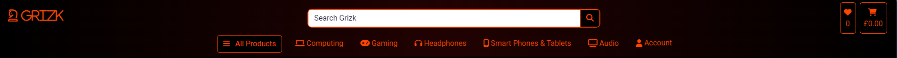

# Grizk

Visit the deployed site: [Grizk](https://ecommerce-grizk-2f04b3042fc5.herokuapp.com/)

## Introduction

Grizk is an e-commerce platform specializing in sophisticated, cutting-edge electronic gadgets designed for tech enthusiasts. Developed as a showcase of a modern and dynamic online store, Grizk offers a wide range of the latest tech products including smart devices, high-end electronics, and accessories, all curated to meet the needs of a digitally connected lifestyle. This project was built using Django, HTML, CSS, JavaScript, and Python as part of my Full Stack Software Development journey.

Grizk combines state-of-the-art technology with a seamless user experience, offering customers the ability to discover, explore, and purchase gadgets from leading brands. The platform integrates a variety of functionalities to enhance the shopping experience, including advanced product search, smooth navigation, and secure payment processing.

With technology evolving rapidly, there is an increasing demand for reliable and user-friendly platforms where consumers can purchase the latest electronics confidently. Grizk aims to address this need by providing a trusted, convenient, and efficient shopping experience for tech-savvy users. The platform highlights the newest releases, trending gadgets, and exclusive deals, making it a go-to destination for anyone looking to stay at the forefront of the tech world.

For testing purchases, you can use the following [Stripe Dummy Card](https://stripe.com/docs/testing) details:

- **Success Card Number:** 4242-4242-4242-4242
- **Expiry Date:** Any future date in MM/YY format
- **CVN:** Any 3-digit number
- **Postcode:** Any 5 numerals  

**Note:** Any payments made using a valid debit/credit card will not be processed, and no charges will be applied. Orders placed for testing purposes will not be fulfilled.

For full Admin access to the Django Admin panel, you can use the following link: [Grizk Admin](https://ecommerce-grizk-2f04b3042fc5.herokuapp.com/admin/)

To access the Admin Dashboard frontend view with relevant credentials, visit: [Grizk Admin Dashboard](https://ecommerce-grizk-2f04b3042fc5.herokuapp.com/products/admin_dashboard/)

AccountSphere empowers you to manage your financial workflows seamlessly in one integrated platform. Embrace smarter financial management today!

- - -

## Table of Contents

- [Grizk](#Grizk)
  - [Introduction](#introduction)
  - [Table of Contents](#table-of-contents)
  - [Overview](#overview)
  - [Customer Goals](#customer-goals)
  - [Business Goals](#business-goals)
- [UX/UI - User Experience/User Interface](#uxui---user-experienceuser-interface)
  - [Design Inspiration](#design-inspiration)
    - [colour Scheme](#colour-scheme)
    - [Typography \& Iconography](#typography--iconography)
- [Project Planning](#project-planning)
  - [Strategy Plane](#strategy-plane)
    - [Site Goals](#site-goals)
  - [Agile Methodologies](#agile-methodologies)
    - [MoSCoW Prioritization](#moscow-prioritization)
    - [Sprints](#sprints)
  - [Marketing](#marketing)
  - [User Stories](#user-stories)
    - [Visitor User Stories](#visitor-user-stories)
    - [Epic - Home View \& User Account](#epic---home-view--user-account)
    - [Epic - Products](#epic---products)
    - [Epic - Basket Management \& Purchasing](#epic---basket-management--purchasing)
    - [Epic - Wishlist](#epic---wishlist)
    - [Epic - Newsletter](#epic---newsletter)
  - [Scope Plane](#scope-plane)
  - [Structural Plane](#structural-plane)
  - [Skeleton \& Surface Planes](#skeleton--surface-planes)
    - [Wireframes](#wireframes)
    - [Database Schema](#database-schema)
    - [Defensive Design](#defensive-design)
- [Features](#features)
  - [User View - Guests/Account Holders](#user-view---guestsaccount-holders)
  - [CRUD Functionality](#crud-functionality)
  - [Features Showcase](#features-showcase)
  - [Future Features](#future-features)
- [Technologies \& Languages Used](#technologies--languages-used)
  - [Libraries \& Frameworks](#libraries--frameworks)
  - [Tools \& Programs](#tools--programs)
- [Testing](#testing)
- [Deployment](#deployment)
  - [Connecting to GitHub](#connecting-to-github)
  - [Django Project SetUp](#django-project-setup)
    - [Elephant SQL](#elephant-sql)
  - [Heroku Deployment](#heroku-deployment)
  - [Google Mail Setup](#google-mail-setup)
  - [AWS Config](#aws-config)
    - [Media Folder Setup](#media-folder-setup)
    - [Django AWS Connect](#django-aws-connect)
  - [Stripe Config](#stripe-config)
  - [Clone Project](#clone-project)
  - [Fork Project](#fork-project)
- [Credits](#credits)
  - [Code](#code)
  - [Media](#media)
    - [Additional reading/tutorials/books/blogs](#additional-readingtutorialsbooksblogs)
  - [Acknowledgements](#acknowledgements)

---
## Overview

Grizk is a cutting-edge electronics store that specializes in providing the latest tech gadgets and sophisticated devices to meet the needs of modern consumers. With a focus on quality and innovation, Grizk brings together a curated selection of electronics from top brands, ranging from smart home devices and mobile accessories to the latest laptops and wearables. Users on Grizk are invited to:

- Explore the store as Guests, with full browsing capabilities
- Register for an Account to access enhanced features
- Utilize the Wishlist to save and track favorite products
- Browse products by category, brand, and price to find the perfect gadget
- Add products to their cart, edit quantities, and proceed to a secure checkout
- As registered users, view their order history and track past purchases
- Subscribe to weekly newsletters for updates on new releases, exclusive deals, and tech news

Grizk is designed to be fully accessible across all modern browsers and is optimized for a seamless experience on different screen sizes, ensuring that users can browse and shop effortlessly whether on desktop, tablet, or mobile devices. With a sleek, intuitive interface, Grizk makes it easy for users to find and purchase the best electronics on the market.

## Customer Goals

Grizk aims to provide a streamlined, intuitive shopping experience that caters to tech enthusiasts of all levels. Customers can easily discover the latest gadgets, compare products, and make informed decisions based on detailed descriptions, specifications, and user reviews. It is anticipated that customers will create accounts on Grizk to take full advantage of features such as wishlist management, faster checkouts, and order tracking. Grizk also encourages customers to stay informed and engaged with tech trends through its regular newsletters, which offer insights into the latest products, promotions, and tech news.

By focusing on quality and user experience, Grizk strives to build trust and loyalty among its customers, making it a go-to destination for anyone looking to keep up with the latest in tech innovation.

## Business Goals

Grizk provides robust and user-friendly administrative functionality for the business owner through an accessible, easy-to-navigate Admin Dashboard. The dashboard simplifies inventory management, order processing, and customer service, allowing admins to make quick and efficient updates to product listings, track orders, and manage customer queries. Additional frontend forms enable seamless content management, including the ability to add, edit, and remove product listings and articles.

Grizk's goal is to establish a solid base of repeat customers who seek reliable, cutting-edge technology from trusted brands. The platform is designed to scale with the business, supporting ongoing growth and new feature development. Marketing efforts, such as targeted social media campaigns, email newsletters, and blog content, help to raise brand awareness and attract new users, driving continued engagement and sales. With a focus on innovation, quality, and customer satisfaction, Grizk aims to be a leader in the competitive world of electronics e-commerce.

# UX/UI - User Experience/User Interface

## Design Inspiration

Grizk’s design captures the essence of modern tech elegance, leveraging a sleek, dark-themed aesthetic that echoes sophistication and innovation. The primary colour scheme revolves around jet black (`#000`) as the background, paired with striking orange-red (`#ff4500`) accents, symbolizing energy and cutting-edge technology. This colour combination is not only visually appealing but also enhances the readability and focus of the content across all devices.

The site maintains a responsive design, ensuring that users on mobile, tablet, and desktop can seamlessly navigate through Grizk’s interface. Key visual elements such as buttons, icons, and product cards are intuitively designed to stand out against the dark background, ensuring that users can quickly identify interactive components.

A minimalist logo, designed using [LogoAI](https://www.logoai.com), is prominently displayed as the favicon and brand signature across the site. The logo’s clean lines and bold colours reinforce the store’s identity as a go-to destination for high-tech enthusiasts.

  
*Grizk logo*

## Dark Theme with Electric Accents

The dark-themed design, with a solid black background, was chosen not only for its sleek, high-tech appearance but also to provide a comfortable, strain-free experience for users browsing for extended periods. Orange-red highlights are strategically used to emphasize calls to action, such as "Add to Cart" and "Checkout," ensuring these elements are easily noticeable.

Buttons across the site feature a smooth hover effect where the colours invert — from black with red accents to a red background with black text. This visual feedback enhances user interactions and draws attention to clickable elements.

## Header & Navigation

The header employs a radial gradient (`#220202` to `#000000`), giving a subtle, polished look that matches the dark theme. Navigation elements are styled with bold, orange-red text that is easy to read and aligns with the overall visual consistency. 

The navigation bar remains sticky across all screens, ensuring users can access essential sections such as the cart, profile, and categories without scrolling back up. For a seamless experience, dropdown menus and off-canvas sections (for wishlist and cart) match the site’s dark theme and accent colours, providing a unified visual presentation.

  
*Intuitive header and navigation for streamlined browsing*

## Footer Design

The footer continues the radial gradient design, providing a cohesive finish to each page. It features social media icons that subtly increase in size when hovered over, inviting users to connect without overwhelming the screen. Subscription forms are embedded within bordered panels, elegantly styled with orange-red outlines that stand out against the dark background, encouraging users to engage with newsletters and updates.

  
*Footer with gradient design and intuitive social icons*

## Product Showcase & Visual Feedback

Product images are displayed in a clean, distraction-free layout to ensure the gadgets are the center of attention. Each product card is designed to hover slightly when interacted with, giving a sense of depth and enhancing the overall user experience. The site employs a flexbox grid system to arrange products dynamically, ensuring consistency across varying screen sizes.

Visual feedback is implemented throughout the interface, including subtle animations and hover effects. For example, toasts pop up on the right side of the screen to confirm actions like adding items to the cart or removing products from the wishlist, ensuring users are always informed.

## Dual Carousel Implementation

### Home Page Carousel (Landing)

Upon entering the Grizk site, users are greeted by a captivating carousel on the homepage. This landing carousel showcases the latest promotions, featured products, and exclusive offers. Each slide features high-resolution product images, a brief description, and a prominent call-to-action button ("Explore Now), styled with the site's signature colours. 

The carousel uses smooth slide transitions (`transform 0.3s ease-in-out`) to create an engaging browsing experience. Users can navigate through slides using intuitive swipe gestures on mobile devices or click through arrows on desktops. The design ensures a seamless, immersive first impression, setting the tone for a sophisticated shopping journey.

### Top Deals Carousel

Further down on the homepage, a secondary carousel highlights top deals, seasonal promotions, and special offers. This section follows a similar design but emphasizes discounts and limited-time offers. Each product card within the carousel is designed to slightly enlarge on hover (`scale(1.05)`), giving a sense of interactivity and depth. The hover effect draws users' attention to these key deals, encouraging exploration.

Both carousels adapt seamlessly across devices, ensuring consistent viewing experiences whether on mobile or desktop. Image resizing and responsive text adjustments allow for clear, legible content presentation without compromising aesthetics.

  
*Dynamic carousels engaging users with key offers*

  
*Visually engaging carousel showcasing top deals*

## Cart & Wishlist Off-Canvas Design

### Off-Canvas Cart

Grizk introduces an off-canvas cart feature that slides in from the side of the screen when activated. This allows users to quickly view and manage their cart items without leaving the current page. 

The cart's design follows the dark theme, with the bright accent colours ensuring important details like item names, quantities, and prices stand out. Buttons to "Checkout" and "Continue Shopping" invert colours on hover, providing immediate feedback to user actions. Each product listed has quantity adjustment controls and a "Remove" button, giving users full control over their purchases.

### Off-Canvas Wishlist

The off-canvas wishlist functions similarly to the cart, enabling users to save products for later. This panel slides in smoothly, showing all saved products with options to add them to the cart or remove them from the wishlist. The same dark colour scheme and accent colours maintain consistency, ensuring users know they are still within the Grizk environment.

Both off-canvas panels are designed to be responsive, adjusting seamlessly to smaller screens. Controls are adequately spaced, and scrollbars appear as needed, ensuring smooth navigation and usability.

  
*Seamlessly integrated off-canvas panels for cart and wishlist*

## Responsive Design & Media Queries

Grizk’s design is fully responsive, utilizing media queries to adapt layouts for different devices. For instance, elements adjust seamlessly between mobile views (`max-width: 320px`) and larger desktops (`min-width: 1801px`), ensuring a smooth and consistent experience. Features like dropdowns, carousels, and off-canvas components scale appropriately, providing intuitive navigation and user interaction across all platforms.

|  |  | | | 
| --- | --- | --- | --- | 
| |  |  |  |
| |  |  |  |

*Consistent, responsive design for all screen sizes*

## Animations & Transitions

Animations are carefully integrated to enhance user interaction without detracting from the browsing experience. For instance, product images gently enlarge on hover (`scale(1.05)`) to draw focus, while buttons smoothly change colour on hover, indicating interactivity. This provides a polished, fluid user experience that aligns with Grizk’s futuristic aesthetic.

Grizk is designed not just as an e-commerce platform but as a digital shopping experience that embodies the sophistication of the tech products it offers. Through thoughtful design, intuitive navigation, and responsive elements, Grizk ensures users are fully engaged from browsing to checkout, no matter their device.

## Colour Scheme

  
*Grizk colour Scheme*

Grizk employs a bold, modern colour palette that emphasizes contrast and clarity, essential for an electronics e-commerce platform. The CSS uses well-defined variables to ensure consistency across the site:

- `--electric-orange`: #ff4500;
- `--deep-black`: #000;
- `--midnight-maroon`: #220202;
- `--soft-gray`: #22223b;
- `--vivid-white`: #fff;
- `--steel-gray`: #aab7c4;
- `--bright-yellow`: #ffc824;

These colours were chosen to provide a sleek, high-tech aesthetic that appeals to tech enthusiasts. The primary colour, `electric-orange` (#ff4500), serves as a bright accent used throughout the site, from call-to-action buttons to hyperlinks and notifications. It ensures that essential elements stand out against the dark, muted backgrounds, guiding users' attention seamlessly. 

### Primary and Accent colours

The `deep-black` (#000) background delivers a sophisticated, minimalist canvas, allowing the `electric-orange` to shine as the main accent colour. This vibrant hue is featured prominently on buttons, interactive elements, and hover effects, ensuring that users can intuitively navigate the site. A touch of `midnight-maroon` (#220202) adds depth and warmth, subtly incorporated in background gradients and header elements to break up the dark theme without overwhelming the user.

### Button and Interactive Elements

Interactive elements on Grizk, such as buttons and clickable links, employ a striking colour contrast. The standard button style features a `black` background with `electric-orange` borders and text, creating a dynamic, eye-catching appearance. On hover, the colours invert—buttons light up in `electric-orange` while the text turns `black`. This creates a clear, responsive visual cue, enhancing the user’s experience and interaction with the site.

  
*Grizk Main Button Design*

### Consistency and Feedback Mechanisms

Grizk utilizes `soft-gray` (#22223b) for secondary backgrounds, borders, and certain text elements to maintain visual balance. When users interact with fields or buttons, a `bright-yellow` (#ffc824) or `electric-orange` appears to provide immediate feedback, confirming the action is available or complete. This approach simplifies navigation, making it easy for users to understand where they are on the site and how they can interact with it.

### Accessibility and Contrast Testing

Colour accessibility is a priority for Grizk. Using [Adobe colour](https://colour.adobe.com/create/colour-accessibility), we ensured that all primary text and essential visual elements meet or exceed WCAG 2.1 guidelines for contrast. This makes the site accessible to users with visual impairments. Below are examples of how these tests were conducted to guarantee clarity and usability:

  
*Grizk colour Accessibility Check*

### Button Contrast

Buttons were rigorously tested to ensure that they are easy to see and interact with on both desktop and mobile devices. colour contrasts between the `electric-orange` and background hues ensure that buttons remain legible under various lighting conditions. This helps prevent misclicks and guides users smoothly through their shopping experience.

### Final Thoughts

Grizk’s colour scheme contributes to a sleek, cohesive design that resonates with tech-savvy users. The high-contrast, minimalist aesthetic emphasizes usability, drawing attention to key actions and features. Consistency across the site ensures a seamless experience, whether users are browsing on desktop or mobile. The combination of `electric-orange` accents with deep, muted backgrounds fosters an inviting yet sophisticated feel, enhancing the overall brand identity of Grizk.

## Typography & Iconography

  
*Grizk Font Pairing*

For Grizk, typography was chosen to convey a sense of modernity, precision, and clarity, essential for an electronics e-commerce platform where users need to quickly grasp product information. The primary typeface used is **Roboto**. 

**Roboto** serves as the main sans-serif font, providing a sleek, modern, and easily readable style that aligns with the brand's high-tech image. It is used extensively for titles, headings, and important labels across the platform, ensuring content is presented clearly and prominently. On the other hand, **Fira Code**, a monospaced font, was chosen for product details and specifications, emphasizing the technical aspects of the electronics listed on the site. This combination provides a robust contrast that enhances the readability and structure of the content, improving the overall user experience.

### Iconography

Grizk's iconography complements its clean, modern aesthetic, using simple, clear icons from the **Font Awesome** library. Icons are employed strategically to guide users through their journey on the site—whether it’s adding products to the cart, favoriting items, or navigating different categories. For example, the shopping cart, wishlist heart, and user account icons are immediately recognizable and provide visual cues to users, enhancing their navigation experience.

---

## Project Planning

### Strategy Plane

The primary objective for **Grizk** was to develop a sophisticated e-commerce platform specializing in cutting-edge tech gadgets. The goal was to ensure a seamless, intuitive, and enjoyable shopping experience, reflecting Grizk's identity as a modern, user-centric electronics store. The platform needed to be fully responsive, offering a consistent experience across all devices, while integrating advanced features such as secure payment systems, intuitive navigation, and personalization options.

Grizk was built to meet the following core goals:

### Site Goals
- **Responsive Design:** Ensure the platform is accessible across all devices, including desktops, tablets, and mobile phones. Users should have a fluid and consistent shopping experience, no matter where they access the site from.
- **User Authentication:** Provide secure and reliable login and registration options for customers, with the ability to save items to a wishlist, view past orders, and receive personalized recommendations.
- **Guest Access:** Allow guests to browse, explore products, and add items to the cart without requiring them to register, simplifying the user journey for first-time visitors.
- **Seamless Checkout:** Utilize **Stripe** as the primary payment gateway, ensuring secure and efficient transactions. The checkout process should be straightforward, with clear feedback and confirmation at each step.
- **Advanced Product Management:** Feature a robust backend for inventory management, enabling easy updates to product details, categories, and availability. 
- **Wishlist & Off-Canvas Panels:** Provide customers with the ability to save their favorite products and access them quickly via intuitive off-canvas panels for easy viewing and management.
- **Integrated Marketing Tools:** Implement features like newsletter subscriptions, personalized recommendations, and SEO-friendly content to drive engagement and improve visibility on search engines.
- **Engaging UI/UX Design:** Design a visually appealing and easy-to-navigate site, with consistent branding elements, to build trust and make the shopping experience enjoyable.
- **Enhanced Security & User Privacy:** Secure user data through encryption and adhere to the best practices in cybersecurity, ensuring that customers can shop with confidence.

### Development Approach

The design and visual assets of the website were curated and created to convey a sleek, modern feel, emphasizing Grizk's commitment to delivering high-quality tech gadgets. **Figma** was utilized to design the initial wireframes and prototypes, ensuring a cohesive design language across all pages and features. The hero images, promotional banners, and product showcases were designed to be visually striking, grabbing the user's attention while maintaining brand consistency.

During the development phase, **Bootstrap** was employed to streamline the responsive design process, while custom **CSS** was used to enhance the visual appeal and interactivity of elements such as buttons, modals, and toast notifications. To maintain uniformity, CSS variables were defined for colors, fonts, and component properties, enabling rapid updates and scaling.

### Key Features Implemented

1. **User-Centric Feedback & Toast Notifications**
   - Users receive immediate feedback during interactions, such as adding items to the cart, completing a purchase, or updating account information. This was achieved using visually distinct toast notifications that match Grizk's color scheme, ensuring clarity and consistency across the site.

2. **Secure Payment Integration with Stripe**
   - Stripe's robust and reliable payment processing was integrated to ensure secure, efficient transactions. Clear visual indicators and confirmations guide the user through the checkout, minimizing friction and improving trust.

3. **Visual Appeal Through Cohesive Branding**
   - Grizk's brand identity is consistently reflected throughout the site using carefully chosen fonts, color schemes, and iconography. This approach fosters brand recognition and enhances user engagement, as customers can easily associate the visual style with quality and reliability.

4. **Dynamic Off-Canvas Panels for Cart & Wishlist**
   - The off-canvas panels allow users to easily manage their cart and wishlist items without disrupting their browsing experience. These panels slide in smoothly, offering quick access to item details, quantity controls, and direct links to proceed to checkout.

### Future Development & Expansion
- **AI-Powered Product Recommendations:** Plans to integrate machine learning algorithms to provide tailored product suggestions based on user behavior and preferences.
- **Interactive 3D Product Views:** Enable customers to view products in a more engaging, interactive format, offering 360-degree visualizations.
- **Enhanced Marketing Integration:** Further development of marketing tools, including dynamic newsletters, limited-time offers, and seasonal promotions, to drive engagement and sales.
- **Multi-Language Support:** Expand accessibility by offering the site in multiple languages, catering to a broader, global audience.

Grizk was developed with scalability and flexibility in mind, ensuring that future enhancements and features can be seamlessly integrated. With a solid foundation in place, Grizk aims to set the standard for tech e-commerce, providing an unmatched user experience that caters to both tech enthusiasts and casual shoppers alike.

## User Experience (UX)

### Project Goal

The primary goal of AccountSphere is to deliver a comprehensive, intuitive financial management platform that simplifies complex financial processes for businesses and organisations. This project is designed to enhance productivity by integrating account management, product management, user role management, and news dissemination into a single, seamless platform. By leveraging modern web technologies and best practices, AccountSphere aims to offer dynamic interaction, data-driven insights, and a customisable user experience that adapts to the unique needs of each organisation.

Through AccountSphere, we strive to empower users to effectively manage their financial workflows, improve operational efficiency, and make informed decisions quickly and accurately. The platform is designed not only to streamline daily tasks but also to provide strategic insights that help businesses grow and adapt in an ever-changing financial landscape.

### Target Audience

The target audience of AccountSphere is diverse, encompassing various professionals and individuals who require efficient financial management tools tailored to their unique needs. This platform is crafted to accommodate Account Officers, Administrators, Product Managers, News Analysts, and first-time users, ensuring each finds features and functionalities aligned with their roles and goals. By addressing the distinct requirements of each user group, AccountSphere provides a seamless experience that empowers users to effectively manage their accounts, monitor trends, and optimise their workflows.

#### `Account Officers`:
- Professionals responsible for managing client financial accounts and transactions.
- Require a centralised platform to streamline daily tasks and deliver accurate financial services.

#### `Administrators`:
- System administrators tasked with maintaining platform security, user roles, and permissions.
- Seek comprehensive management controls to oversee user access, compliance, and data integrity.

#### `Product Managers`:
- Individuals overseeing product development and lifecycle management.
- Need detailed insights into product performance and market trends to make data-driven decisions.

#### `News Analysts`:
- Analysts focused on industry trends and internal news for their organisations.
- Require efficient tools to collect, curate, and disseminate relevant information to stakeholders.

#### `First-Time Users`:
- New users unfamiliar with AccountSphere seeking an intuitive platform to manage their workflow.
- Want a user-friendly onboarding experience and clear guidance on accessing key features.

#### `Business Owners`:
- Entrepreneurs and executives needing a comprehensive financial management solution.
- Look for a platform to streamline workflows, optimise resource allocation, and ensure data compliance.

### User Goals

#### `First Time User Goal`

For first-time users of AccountSphere, the objective is to provide an intuitive, welcoming interface that demystifies financial management. The platform aims to deliver a clear, straightforward onboarding process that helps new users quickly understand the core functionalities and how they can benefit their specific roles. From setting up an account to navigating through the various management modules, first-time users will find guidance and support at each step.

The design and structure of AccountSphere are crafted to reduce the learning curve and enhance user confidence, ensuring that users can start managing their financial tasks efficiently from their first login. The system is designed to offer quick wins for new users, such as easy setup of financial accounts or user roles, encouraging continued use and deeper exploration of the platform's capabilities.

#### `Account Officer Goal`

For Account Officers, AccountSphere aims to streamline their daily tasks by providing a centralised platform where they can efficiently manage client accounts. The platform's goal is to empower Account Officers with the tools they need to easily create, update, and monitor financial records while ensuring accuracy and compliance. Features like search functionality, detailed transaction histories, and customisable reports allow Account Officers to quickly access the information they need and identify opportunities or potential issues. With AccountSphere, Account Officers can deliver a high level of service while minimising administrative overhead.

#### `Administrator Goal`

Administrators are focused on maintaining system integrity and ensuring that the platform runs smoothly for all users. AccountSphere's goal for Administrators is to offer comprehensive management controls that enable them to handle user roles, permissions, and data security with precision and ease. Administrators can manage user access, monitor system usage, and enforce compliance policies directly within the platform. By providing a robust set of administrative features, AccountSphere helps Administrators maintain security, data integrity, and smooth operations while reducing complexity.

#### `Product Manager Goal`

For Product Managers, AccountSphere aims to provide a holistic view of product lifecycles, enabling them to oversee product development, track market trends, and make data-driven decisions. The goal is to help Product Managers efficiently manage their product portfolios by centralising product information, facilitating collaboration, and providing in-depth analytics. They can easily update product details, monitor sales data, and identify opportunities for product optimisation or expansion. AccountSphere helps Product Managers translate insights into actionable strategies that align with broader business objectives.

#### `News Analyst Goal`

AccountSphere's objective for News Analysts is to simplify the process of collecting, organising, and analysing industry news and internal updates. The platform is designed to help News Analysts efficiently curate and disseminate relevant information to different teams, ensuring everyone stays informed about key developments. Analysts can track trends, identify emerging risks, and provide stakeholders with timely, accurate insights. AccountSphere also supports collaborative feedback, enabling Analysts to refine their news content based on user engagement and strategic goals.

#### `Business Goal`

The overarching business goal of AccountSphere is to establish itself as a leader in the financial management software industry, recognised for innovation, reliability, and user satisfaction. By delivering a high-quality, scalable solution that meets the diverse needs of businesses across industries, AccountSphere aims to expand its market share and foster a loyal user base.

The business strategy includes continuous improvement based on user feedback, leveraging cutting-edge technology to enhance features, and maintaining rigorous security standards to protect user data. Through strategic partnerships, targeted marketing, and exceptional customer support, AccountSphere plans to grow its presence globally and help organisations around the world achieve financial clarity and success.

### User Stories

#### `First Time User Stories`

- Create: As a first-time user, I want to create my initial profile during onboarding so that I can start using AccountSphere quickly.
- Read: As a first-time user, I want a clear guide on how to set up and manage my accounts so that I can navigate the platform without confusion.
- Update: As a first-time user, I want to customise my dashboard view so that I can prioritise the features I use most often.
- Delete: As a first-time user, I want to remove any test data created during onboarding so that I can maintain an accurate account record.

#### `Account Officer User Stories`

- Create: As an Account Officer, I want to create new client accounts so that I can expand the client base and deliver accurate services.
- Read: As an Account Officer, I want to quickly search for specific accounts so that I can retrieve information efficiently.
- Update: As an Account Officer, I want to update existing client accounts so that I can ensure accurate information and compliance.
- Delete: As an Account Officer, I want to deactivate or delete outdated client accounts so that I can maintain a clean and relevant database.

#### `Administrator User Stories`

- Create: As an Administrator, I want to create user roles and permissions so that I can control access levels across the platform.
- Read: As an Administrator, I want to monitor user activity so that I can identify any potential system issues or suspicious behavior.
- Update: As an Administrator, I want to modify user permissions so that I can provide the necessary access as responsibilities evolve.
- Delete: As an Administrator, I want to remove inactive or unauthorised users so that I can maintain system security.

#### `Product Manager User Stories`

- Create: As a Product Manager, I want to create new product entries so that I can manage the entire lifecycle from development to release.
- Read: As a Product Manager, I want to oversee product lifecycles so that I can make data-driven decisions on product strategies.
- Update: As a Product Manager, I want to update product details easily so that I can ensure information is accurate and current.
- Delete: As a Product Manager, I want to archive or remove obsolete products so that I can keep the portfolio clean and relevant.

#### `News Analyst User Stories`

- Create: As a News Analyst, I want to create new articles and reports so that I can keep stakeholders informed about industry trends.
- Read: As a News Analyst, I want to analyse news trends and readership so that I can identify emerging risks or opportunities.
- Update: As a News Analyst, I want to revise or update articles to ensure the information remains relevant and accurate.
- Delete: As a News Analyst, I want to remove outdated or inaccurate articles so that I can provide a clean and reliable news board.

- - -

## Design Choices

### Colour Scheme

The colour scheme of AccountSphere has been deliberately selected to establish a professional, clear, and appealing interface that enhances usability and visual aesthetics. The primary colour used throughout the platform include shades of grey and vibrant highlights, which not only create a modern look but also aid in distinguishing between different UI elements effectively. Here’s a detailed breakdown of the colour palette:

- `#3a405a (Slate Blue)`: Serving as the dominant background and accent colour, this shade defines the overall visual identity of the platform. It appears prominently in the navbar, buttons, and cards, providing a professional look that conveys sophistication and confidence.

- `#ffffff (White)`: White is primarily used for the text and main background of forms, dashboards, and other elements, ensuring high contrast and readability. This universal and clean shade gives a fresh and uncluttered feel to the user interface.

- `#fff (White) and #3a405a (Slate Blue)`: The combination of these colour makes interactive buttons prominent, enhancing the navigation and actions across the interface. These colour also highlight key UI elements and cards to create an intuitive and user-friendly experience.

- `#fff (White) and Black for Buttons`: For the buttons, a classic white-on-black and black-on-white contrast is employed, creating visual appeal and drawing attention to call-to-action areas.

- `#000000 (Black)`: Appears in close buttons and provides contrast against white backgrounds.

- `#f0f0f0 (Light Gray`): Used for the news panel to differentiate the section and improve content readability.

- `Slate Blue Accents`: Various UI components, such as panels, headlines, and borders, are highlighted in slate blue to maintain consistency across the platform. These accents are crucial for intuitive navigation and visual hierarchy.

- `News Panel Accent`: The news panel utilises a subtle gradient of white and grey to distinguish it from other sections. This panel retains the visual theme but incorporates a gentle distinction to improve the readability of content.

This carefully curated colour scheme leverages a mix of neutral tones and vibrant accents to create a professional, engaging, and accessible platform. The deliberate use of white and slate blue ensures that essential information stands out, while the uniformity across the platform provides a seamless experience for users navigating through different sections of AccountSphere.

### Typography

For the typography of AccountSphere, the Roboto font from Google Fonts was selected to align with the platform's modern and professional aesthetic.

- `Primary Font: Roboto` - This sans-serif typeface offers a clean, contemporary look that enhances the platform's user experience. Its narrow letterforms and balanced proportions lend themselves well to both headings and body text, ensuring clarity and legibility across various screen sizes and devices.

The use of Roboto throughout AccountSphere reinforces the platform's focus on streamlined functionality and effective communication. This font choice complements the platform's focus on financial management and business operations, providing a professional yet approachable appearance that aligns with the target audience's needs and preferences.

### Imagery

The imagery used in AccountSphere enhances the user experience by creating a visually engaging and professional platform that aligns with its financial management focus. The visual elements have been carefully curated to reflect the platform's branding and thematic focus, providing a cohesive and appealing atmosphere for users.

- `Background Images`: The background images for AccountSphere are high-quality visuals that align with the platform's business-oriented focus. These images, sourced from [Vecteezy](https://www.vecteezy.com/), provide a clean and modern backdrop that supports the user interface without overwhelming it. The choice of images ensures a professional appearance that resonates with the platform's audience.

- `Iconography and Logo`: The logo and icons used in AccountSphere reflect the platform's emphasis on financial management and business operations. The logo, a stylised representation of financial elements, serves as a visual anchor for the site, reinforcing the platform's identity and purpose. The icons, sourced from [Vecteezy](https://www.vecteezy.com/), offer clear visual communication and thematic consistency, enhancing the platform's usability and user experience.

### Wireframes

The development of AccountSphere began with the creation of detailed wireframes that outlined the structure and layout of each page. These wireframes served as the visual blueprint for designing a user-friendly interface that ensures a seamless experience across the platform. 

Each wireframe was crafted with careful attention to user experience, emphasising intuitive navigation and efficient workflows that align with the goals of various user roles, including administrators, account officers, product managers, and news analysts.

#### `Login Page Wireframe`

The login page wireframe shows a streamlined, user-friendly design focused on getting users into the system efficiently. It includes fields for username and password, as well as buttons for submission and navigation to the registration page for new users.

#### `Profile Page Wireframe`

The profile page wireframe provides a structured layout where users can view and manage their personal information. This design is optimized for ease of navigation, allowing users to edit their profile, view their recent activities, and access different management features.

#### `Account Management Page Wireframe`

The account management page wireframe illustrates a comprehensive view where Account Officers can manage user accounts. The interface allows for viewing detailed account information, performing search operations, and initiating account modifications.

#### `AD_Group Management Page Wireframe`

This wireframe details the Active Directory group management page, providing administrators with an intuitive interface to manage user groups and their permissions. The layout facilitates easy group creation, editing, and deletion.

#### `Product Management Page Wireframe`

The product management page wireframe provides Product Managers with a clear overview of all products. They can update product details, analyse performance, and coordinate with other teams to optimise the product lifecycle.

#### `User Management Page Wireframe`

These wireframes depict the user management page, where administrators can efficiently manage user roles and permissions. The design ensures ease of adding new users, editing their roles, and handling deletions while maintaining data integrity.

These wireframes guided the design process to ensure that AccountSphere provides a visually consistent and efficient user interface that aligns with the platform's overall goals.

### Flowchart

To visualise the user journey and functionality of AccountSphere, detailed flowcharts were developed. These flowcharts outline the interactions between the different components of the platform, demonstrating how users navigate through various features and perform essential tasks.

Each flowchart focuses on a specific aspect of AccountSphere, capturing the logical flow of user actions and system responses, ensuring that the platform operates smoothly and efficiently. The flowcharts serve as valuable guides for understanding the system's architecture and how different roles—such as administrators, account officers, product managers, and news analysts—interact with the platform.

#### `Authentication Flow`

The authentication flow diagram outlines how users gain access to AccountSphere. It covers the steps for login and registration, ensuring secure access and proper onboarding.

#### `Account Management Flow`

This flowchart shows how Account Officers handle account creation, updates, and deletions. It provides a streamlined approach for managing client data and maintaining accurate records.

#### `Product Management Flow`

The product management flow outlines how Product Managers oversee product lifecycles. It emphasises efficient coordination between product development, market trend analysis, and portfolio optimisation.

#### `News Management Flow`

The news management flowchart displays how News Analysts curate and disseminate relevant information. It demonstrates the steps involved in collecting, organising, and sharing important updates with stakeholders.

#### `Administrator Flow`

This diagram illustrates the responsibilities of Administrators in maintaining system integrity. It highlights their role in managing user roles, permissions, and ensuring compliance and data security.

These flowcharts illustrate the interactions between users and the system, highlighting key functionalities and decision points within AccountSphere. They ensure that the platform is designed to meet user needs effectively while maintaining robust security and operational efficiency.

### Entity-Relationship Diagram
The Entity-Relationship Diagram (ERD) provides a visual overview of the relationships and data structure within the AccountSphere application. This diagram illustrates how different data entities such as users, groups, accounts, products, and news items interact with each other, helping to clarify the system's architecture.

The ERD is crucial for understanding how data is organised, stored, and accessed within the application. Each entity corresponds to a table in the database, with attributes representing the columns of that table. Relationships between entities, indicated by lines, depict foreign key constraints, showing how data is linked together.

In this diagram:

- `User`: Represents an individual accessing the platform, who belongs to a specific group.
- `Group`: Contains information about various user groups for role-based access management.
- `Account`: Represents financial accounts linked to a specific product.
- `Product`: Contains details about products available within the system, each having a unique association with multiple accounts.
- `NewsItem`: Contains information about various news articles related to finance.

This diagram not only showcases the logical structure of the database but also provides insight into how CRUD operations are performed across different modules in the application. Understanding this structure is essential for maintaining, enhancing, and scaling the application over time.

### Role-Based Access Control

The application employs Role-Based Access Control (RBAC) to manage user permissions and ensure that only authorised users can access certain functionalities. This approach enhances security by limiting access to sensitive operations based on the user's role within the system.

#### `Roles Defined`
- **Administrator:** Has the highest level of access, including managing users, groups, products, accounts, and news items.
- **Account Officer:** Responsible for managing accounts, including adding and editing accounts.
- **News Analyst:** Responsible for managing news items, including adding, editing, and deleting news.
- **Product Manager:** Responsible for managing products, including adding and editing products.

#### `RBAC Implementation`

RBAC is implemented using a decorator function, `role_required`, which checks if the currently logged-in user has the required role(s) to access a specific route. If the user does not have the necessary permissions, they are redirected to the profile page with a flash message indicating insufficient permissions.

#### `Administrator Role Protection`

To protect the administrator role from being selected by public users during registration, it is excluded from the list of roles presented in the registration form. This is done by filtering out the 'Administrator' role from the available options.

### Features

The AccountSphere web application provides a comprehensive solution for financial management, offering a range of interactive features that cater to different user roles for ease of use and enhanced productivity.

**All Pages Feature:**

* `Responsive Navigation`: Consistent navigation across all pages ensures that users can seamlessly access sections like accounts, products, and user management. Navigation links are well-labeled and intuitive, reducing the learning curve for new users.

  

* `Search Functionality`: Each management page includes a dedicated search bar that filters data quickly, enabling efficient information retrieval. Users can search based on keywords and multiple criteria to locate the information they need swiftly.

  

* `Mobile-Friendly Layout`: The application's responsive design ensures a seamless user experience across desktops, tablets, and mobile devices. Content adapts dynamically to different screen sizes, maintaining usability and clarity across devices.

* `Access Control`: Role-based access control ensures that each user has permissions aligned with their role, whether it's an Account Officer, Administrator, Product Manager, or News Analyst. This minimises risks associated with data security and unauthorised access.

**Specific Role-Based Features:**

* `Account Officer Features`: 
  - Efficient account creation, updating, and management
  - Quick search for client accounts and data filtering

* `Administrator Features`:
  - Manage user roles and permissions for maintaining system security
  - Enforce compliance policies directly within the platform

* `Product Manager Features`:
  - Comprehensive product lifecycle oversight
  - Efficient product creation, updating, and management

* `News Analyst Features`:
  - Efficiently collect, organise, and analyse industry news and updates
  - Track trends and emerging risks for accurate insights
  - Curate and disseminate relevant information to stakeholders efficiently

These features collectively contribute to a robust financial management platform that addresses the unique needs of different user roles, ensuring accurate, efficient, and secure workflows.

#### `Login Page`

The login page offers a secure and user-friendly gateway to AccountSphere:

* `Simple Login Form`: Features username and password fields for authentication. Users can quickly enter their credentials to access their accounts securely.

* `Sign-Up Link`: Directs new users to the registration page for account creation. This option ensures that first-time users can easily set up their accounts.

* `Error Handling`: Provides feedback for incorrect login credentials. If a user enters invalid information, clear error messages guide them to rectify the issue.

#### `Registration Page`

The registration page is designed to provide a seamless onboarding experience for new users:

* `Intuitive Form Layout`: Presents fields for entering personal information, including first name, last name, username, email, and password.

* `Role Selection`: Allows users to choose their role within the organisation, ensuring appropriate access to platform features.

* `Password Confirmation`: Ensures that users enter their desired password correctly by requiring re-entry in the confirmation field.

* `Error Handling`: Offers user-friendly error messages if mandatory fields are incomplete or if passwords do not match.

#### `Profile Page`

The Profile Page in AccountSphere serves as a centralised dashboard for users, providing them with immediate access to a wide array of features and functionalities tailored to their roles within the platform:

* `Dynamic Greeting and Time Display`: At the top of the page, users are greeted with a personalised message that changes based on the time of day, enhancing the user experience with a warm welcome. Additionally, a real-time clock displays the current day and time, helping users manage their schedule more effectively.

* `Carousel of Visual Highlights`: A visually appealing carousel showcases relevant images such as world maps, teamwork concepts, and transformational changes, offering users an engaging and informative visual experience right on their profile page.

* `Quick Access Cards`: Below the carousel, a series of cards provide quick access to major management sections like Accounts, Groups, Products, Users, and News Board. Each card includes a thumbnail image related to the section and a direct link, simplifying navigation and enhancing efficiency:

  * `Accounts Card`: Directs users to manage financial accounts.
  * `Groups Card`: Provides access to group management functionalities.
  * `Products Card`: Links to product management settings.
  * `Users Card`: Offers a shortcut to user management tools.
  * `News Board Card`: Leads to the latest news and updates within the organisation.

* `Interactive News Panel`: Adjacent to the quick access cards, a dedicated panel for Trending Articles displays the latest news items. This panel supports scrolling, making it easy for users to browse through various articles. Each news item is presented with a headline and a brief description, ensuring users are well-informed about recent developments.

* `Responsive Design`: The entire profile page is designed to be responsive, ensuring that all elements display correctly across different devices and screen sizes, enhancing the user's experience whether on desktop, tablet, or mobile.

#### `Account Management`

The Account Management Board in AccountSphere enables Account Officers and other relevant roles to efficiently oversee client accounts and manage key financial data.

* `Search Bar`: A search function allows users to quickly find specific accounts by filtering based on client name, email, or other relevant data fields.

* `Account Overview`: A table displays all managed accounts in a comprehensive view, including columns like client name, account type, balance, and currency. The table is sortable, providing flexibility in reviewing data.

* `Create New Account`: A prominently positioned button enables the creation of new client accounts. Clicking this button redirects to the "Add Account" page, where users can fill out necessary client information.
  

* `Edit and Delete Options`: Each row in the table provides edit and delete icons that let Account Officers update client information or remove an account if needed. A modal prompts the user to confirm their choice before deleting.
  
  

* `Responsive Design`: The board is optimised for various screen sizes, ensuring Account Officers can access data and perform their tasks effectively across desktop, tablet, and mobile devices.

* `Navigation Links`: Quick links to other sections, like Product and User Management Boards, are included to streamline navigation.

#### `Active Directory Groups`

The AD Group Management Page in AccountSphere offers Administrators an organised interface for managing Active Directory groups efficiently.

* `Search Bar`: Allows Administrators to filter groups by name, description, or group type to quickly locate relevant information.

* `Group List`: Displays all available groups in a sortable table format with columns like group name, description, and group type. This comprehensive overview helps Administrators manage and review group data effectively.

* `Create New Group`: A button that links to the "Add AD Group" page, where new Active Directory groups can be defined and added to the system.
  

* `Edit and Delete Actions`: Each group entry in the table includes edit and delete buttons, allowing Administrators to modify or remove a group. A confirmation modal ensures that groups are not deleted accidentally.
  
  

* `Navigation Links`: Includes links to other management sections like Accounts and Products, helping Administrators quickly navigate between different management tasks.

* `Responsive Layout`: The page is optimised for various devices, ensuring seamless group management whether the Administrator is using a desktop or mobile device.

#### `News Board`

The News Board page in AccountSphere serves as a centralised hub for keeping team members updated with relevant articles and internal announcements.

* `Search Bar`: Helps News Analysts quickly find specific articles or announcements by filtering based on keywords in the title or description.

* `News List`: Displays a table with all published news items, organised by headlines, brief descriptions, and publication dates. This summary view allows stakeholders to quickly scan for key updates.

* `Create New Article`: A button links to the "Add News" page where analysts can draft and publish new articles for immediate dissemination.
  

* `Edit and Delete Actions`: Each article entry includes edit and delete buttons, providing Analysts with full control over the content. Confirmation dialogs are used to prevent accidental deletions.
  
  

* `Trending Articles`: Highlights important or popular articles to draw attention to them. This helps team members prioritise their reading.

* `Collaboration and Feedback`: Team members can leave comments or suggestions, fostering a collaborative environment to refine the news content.

* `Responsive Design`: The layout ensures a smooth reading experience on devices ranging from desktops to smartphones.

#### `Product Management`

The Product Management page in AccountSphere provides a comprehensive overview of the products available and allows efficient management for Product Managers.

* `Search Bar`: A quick search feature lets managers find specific products by name or description, streamlining the management process.

* `Product List`: Displays all available products in a card layout, with each card containing the product name, description, and type. This layout provides a clear overview of the product catalog.

* `Create New Product`: A button directs to the "Add Product" page, where new products can be defined and added to the catalog.
  

* `Edit and Delete Actions`: Each product card includes edit and delete buttons, enabling quick modifications or removal of outdated products.
  
  

* `Product Details`: Clicking on a product card reveals more information, such as associated accounts, sales data, and performance metrics.

* `Analytics Integration`: Managers can view analytics and insights related to each product's lifecycle, helping them make data-driven decisions.

* `Responsive Design`: The layout adapts to different screen sizes, ensuring managers can easily access product information from any device.

#### `User Role Management`

The User Board in AccountSphere allows administrators to manage user accounts effectively through various functionalities.

* `Search Functionality`: The search bar helps administrators quickly find users based on their first name, last name, username, email, or role.

* `User List`: Displays a table of all registered users with columns for the first name, last name, username, email, and role. This table provides a comprehensive overview of the user base.

* `Add New User`: A button leads to the "Add User" page, where new user accounts can be created with details like name, email, username, and password.
  

* `Edit and Delete Actions`: Each row contains edit and delete buttons, allowing administrators to update user information or remove accounts.
  
  

* `Role Management`: Administrators can assign, update, or change user roles directly from the board, ensuring that the right permissions are granted.

* `Responsive Layout`: The table is fully responsive, ensuring that administrators can easily manage users on both desktop and mobile devices.

#### `Password Reset Page`

The Password Reset page provides users with a secure way to change their passwords directly in AccountSphere.

* `Old Password Verification`: Users must input their current password to verify their identity before setting a new one.

* `New Password Fields`: Two fields for the new password and its confirmation ensure accuracy and prevent typos.

* `Validation`: Password validation checks that the new password meets length and complexity requirements.

* `Update Button`: The "Update" button securely saves the new password after successful verification and validation.

* `Cancel Button`: A "Cancel" button allows users to exit without making changes, returning them to the profile page.

* `Responsive Design`: The form adjusts to different screen sizes, ensuring ease of use across devices.

#### `Log Out Functionality`

The log-out feature ensures secure exit from AccountSphere:

* `Secure Logout`: Upon logging out, the current session is terminated, and all authenticated data is cleared.

* `Confirmation Message`: Users receive a notification confirming their successful logout.

* `Redirect to Home`: After logout, users are redirected to the Home page to start a new session or browse public content.

* `Access Restriction`: Access to protected pages is immediately revoked for logged-out users, preventing unauthorised access.

* `Login Prompt`: The login page encourages users to authenticate again if required, ensuring a secure re-entry.

* `Mobile Compatibility`: The log-out feature works seamlessly across different devices, enhancing user security on the go.

#### `404 Page`

The 404 error page provides a user-friendly way to handle navigation issues:

* `Clear Error Message`: Informs users that the page they tried to access is not available, providing clarity on the issue.

* `Navigation Options`: Offers links back to the Home Page and other relevant sections, enabling users to quickly find their way back to familiar content.

* `Consistent Design`: Maintains the overall style of the platform to ensure a cohesive user experience, even in error states.

* `Mobile Responsiveness`: Adapts gracefully across screen sizes to ensure users can always recover from errors on any device.

### Future Implementations

AccountSphere is committed to continuous improvement and user-centric enhancements. Here are some of the future implementations planned to enrich the platform's capabilities and user experience:

#### `Advanced Analytics Dashboard`
- **Goal**: To provide users, especially Account Officers and Product Managers, with more sophisticated tools for data analysis and decision-making.
- **Features**: Interactive charts, real-time data updates, and customisable reports that cater to the specific needs of different user roles.

#### `Mobile Application`
- **Goal**: To offer a dedicated mobile application for iOS and Android to enhance accessibility and on-the-go management.
- **Features**: Seamless synchronisation with the web platform, offline access to critical data, and mobile-specific user interface enhancements.

#### `Integration with External Financial Services`
- **Goal**: To expand functionality by integrating with external financial APIs, allowing users to manage payments, invoicing, and other financial services directly through AccountSphere.
- **Features**: Secure connections to major financial platforms, streamlined payment processing, and expanded reporting capabilities.

#### `AI-Driven Insights for Account Management`
- **Goal**: To implement artificial intelligence technologies to provide predictive analytics and personalised insights for account management.
- **Features**: AI algorithms that analyse user data to predict trends, suggest optimisations, and alert users about important account changes or opportunities.

#### `Customisable User Interface`
- **Goal**: To allow users to customise the interface according to their preferences and organisational branding.
- **Features**: Theme options, layout configurations, and the ability to add custom logos and colour schemes.

#### `Enhanced Security Features`
- **Goal**: To further enhance the security of the platform to protect sensitive financial data.
- **Features**: Two-factor authentication, advanced encryption methods, and continuous security audits.

#### `Multi-language Support`
- **Goal**: To make AccountSphere accessible to a global audience by supporting multiple languages.
- **Features**: Language selection options, culturally relevant user interface adaptations, and support for right-to-left text layouts.

### `Accessibility`

AccountSphere prioritises accessibility to ensure an inclusive and user-friendly platform. We strive to create an environment where all users, regardless of their abilities or disabilities, can effectively use the application. Here are some key accessibility features and considerations:

#### `Semantic HTML`
- **Goal**: Improve screen reader compatibility and navigation for visually impaired users.
- **Features**: Proper use of headings, landmarks (e.g., `<nav>`, `<main>`, `<footer>`), and descriptive `<alt>` attributes for images to provide context.

#### `Keyboard Navigation`
- **Goal**: Enable navigation and control of all interactive elements via keyboard for users with mobility impairments.
- **Features**: Logical tab order, focus indicators, and keyboard shortcuts ensure a seamless user experience without a mouse.

#### `Contrast and colour Choices`
- **Goal**: Enhance readability and visibility for users with colour blindness or low vision.
- **Features**: High-contrast colour schemes and colour-blind-friendly designs.

#### `Form Accessibility`
- **Goal**: Make form inputs and labels usable and understandable by all users.
- **Features**: Explicit `<label>` elements associated with their respective inputs, informative error messages, and user-friendly validation.

#### `Text Resizing and Scaling`
- **Goal**: Allow users to adjust text size without compromising layout or functionality.
- **Features**: Responsive design, flexible font sizes, and media queries to ensure content adapts to user preferences.

#### `Assistive Technology Compatibility`
- **Goal**: Ensure the application functions smoothly with popular assistive technologies.
- **Features**: Regular testing with screen readers, magnifiers, and speech recognition tools to address compatibility issues.

- - -

## Technologies Used

The development of AccountSphere involves a range of modern web technologies and software tools, ensuring a robust, secure, and user-friendly platform for financial management. Below is a detailed overview of the key technologies and tools utilized in creating AccountSphere:

### Languages Used

|  |  |
| -- | --|
|  | The structural foundation of our application, used to build the framework and content layout of the web pages. |
|  | Enhances the presentation of our web application, controlling the layout, colours, and fonts to ensure an engaging and adaptive user interface. |
|  | Powers the dynamic aspects of AccountSphere, enabling interactive elements and real-time functionality without the need for page reloads. |
|  | Utilized for server-side logic, including request handling, data manipulation, and interacting with the database. |
| | |

### Frameworks, Libraries & Programs Used

* [Adobe Express](https://new.express.adobe.com/tools/convert-to-gif) - Used to remove background from logo image and to convert videos to GIF

* [Am I Responsive?](http://ami.responsivedesign.is/) - To show the website image on a range of devices.

* [Balsamiq](https://balsamiq.com/) - Used to create wireframes.
  
* [Bootstrap](https://getbootstrap.com/) - Extensive library of HTML, CSS, and JS tools used to create mobile-first and responsive web pages.

* [Favicon.io](https://favicon.io/) - To create favicon.

* [Flask](https://flask.palletsprojects.com/) - A lightweight WSGI web application framework, used to facilitate the backend setup, URL routing, and the integration of front-end technologies.

* [Flask-Migrate](https://flask-migrate.readthedocs.io/en/latest/) - An extension that handles SQLAlchemy database migrations for Flask applications using Alembic.

* [Font Awesome](https://fontawesome.com/) - A font and icon toolkit based on CSS and LESS, used to incorporate custom icons throughout the application.

* [Git](https://git-scm.com/) - For version control to track changes in the source code during development.

* [GitHub](https://github.com/) - Hosts the repository that can be deployed to GitHub Pages, providing backup and version control.

* [Github Project Board](https://github.com/users/GOkwori/projects/3/views/3) - For project management and tracking.

* [Heroku](https://www.heroku.com/) - A cloud platform as a service supporting several programming languages, used to deploy the web application.

* [Jinja](https://jinja.palletsprojects.com/) - A modern and designer-friendly templating language for Python, modeled after Django’s templates. Used to dynamically render HTML templates.

* [Microsoft Visio](https://www.microsoft.com/en-us/microsoft-365/visio/flowchart-software) - Employed for creating clear and detailed flowcharts and ERDs (Entity-Relationship Diagrams) to visualize data relationships and process flows in the application.

* [PostgreSQL](https://www.postgresql.org/) - An open-source relational database system used to manage the application’s data effectively.

* [SQLAlchemy](https://www.sqlalchemy.org/) - The Python SQL toolkit and Object-Relational Mapping (ORM) system that gives application developers the full power and flexibility of SQL.

* [Visual Studio Code](https://code.visualstudio.com/) - The source-code editor used for software development, offering features such as debugging, syntax highlighting, and code refactoring.

- - -

## Deployment & Local Development

### Deployment

AccountSphere is deployed using Heroku, a cloud platform that enables developers to build, run, and operate applications entirely in the cloud.

To deploy the site using Heroku:

1. Login (or signup) to [Heroku](https://www.heroku.com/).
2. From the dashboard, create a new app by selecting "New" -> "Create new app."
3. Give your app a name (must be unique) and select the region closest to your location.
4. Once the app is created, connect your app to your GitHub repository:
    - Go to the "Deploy" tab in your Heroku dashboard.
    - Select "GitHub" as the deployment method.
    - Connect to GitHub by entering your GitHub account credentials.
    - Search for the repository name and click "Connect".
5. Configure environment variables under "Settings" -> "Reveal Config Vars". Set keys like `SECRET_KEY`, `DATABASE_URL`, etc.
6. Go back to the "Deploy" tab and scroll down to "Manual deploy".
    - Choose the branch you want to deploy (usually "main" or "master").
    - Click "Deploy Branch".
7. After deployment, Heroku will give you a URL to access your deployed application.
8. Click on "Open app" in the top right of the dashboard to view your deployed site.

### Local Development

#### `How to Fork`

To fork the repository:

1. Log in (or sign up) to GitHub.
2. Navigate to the repository for this project on GitHub.
3. Click the "Fork" button in the top-right corner of the page.

#### `How to Clone`

To clone the repository:

1. Log in (or sign up) to GitHub.
2. Navigate to the repository for this project on GitHub.
3. Click on the "Code" button, then choose to clone via HTTPS, SSH, or GitHub CLI, and copy the URL provided.
4. Open your terminal.
5. Change the current working directory to the location where you want the cloned directory.
6. Type `git clone`, then paste the URL you copied earlier.
7. Press Enter to create your local clone.

- - -

## Testing

For a comprehensive overview of all testing conducted during the development of AccountSphere, please refer to the [Testing.md](testing.md) file. This document includes detailed test cases, results, and methodologies used.

### Solved Bugs

The development of AccountSphere involved identifying and resolving several bugs to enhance functionality and user experience. Below is a table detailing some of the notable bugs encountered and the fixes applied:

| No | Bug | Description | Fix Applied | 
| --- | --- | --- | --- | 
| 1 | `Form submission error` | Users experienced form submission issues on the account creation page due to incorrect form data validation. | Corrected the form validation logic to ensure accurate data processing. |
| 2 | `Login redirect error` | After successful login, users were not redirected to their profile page. | Implemented a redirect to the profile page upon successful authentication. |
| 3 | `Database connection timeout` | The application experienced frequent database timeouts. | Optimised database queries and revalidated database connection settings. |
| 4 | `Responsive layout issues` | Some pages were not displaying correctly on mobile devices. | Applied additional responsive CSS fixes to ensure compatibility across all devices. |
| 5 | `Search functionality not working` | The search feature in user management was returning incorrect results. | Refined the search algorithm to accurately filter and display results based on user queries. |
| 6 | `Security vulnerability in user session` | A security vulnerability was discovered that could allow an unauthorised user to access session data. | Enhanced session management and implemented additional security checks. |
| 7 | `Missing error messages` | Error messages were not displayed to the user on failed login attempts. | Added error handling to catch and display appropriate feedback messages to the user. |
| 8 | `Product deletion error` | Users were unable to delete products due to a foreign key constraint error. | Adjusted the database schema to properly handle deletions with cascade rules. |
| 9 | `Group management access rights` | Non-administrative users were able to access and modify group settings. | Revised access controls to restrict group management functionalities to administrators only. |

These fixes have significantly improved the stability, security, and usability of AccountSphere, ensuring a reliable and efficient experience for all users.

- - -

## Credits

### Code References

#### `Web Frameworks and Libraries`
- **Flask**: Used for server-side logic including routing and session management.
- **Jinja2**: Templating engine for rendering HTML from data.
- **SQLAlchemy**: ORM used for database interactions.
- **Flask-Login**: For handling user authentication.
- **Bootstrap**: For responsive design and UI components.

#### `Tutorials and Guides`
- **YouTube Python Authentication and Role Based Access Control (RBAC) Tutorial**: Provided guidance for setting up authentication features.
  - [YouTube Python Authentication Tutorial](https://www.youtube.com/watch?v=71EU8gnZqZQ)
  - [YouTube Python Authentication Tutorial](https://www.youtube.com/watch?v=7AkJvQXOjYg)
- **YouTube Series for User Management System**: Helped in implementing user roles and permissions.
  - [Code Maven](https://www.youtube.com/watch?v=SzWNnUdY6ZE&list=PL193izPqf5X51LG3xhVgeLuIUKbe9a_qs)
- **Code Institute Walkthrough Projects**: Offered foundational knowledge and reusable patterns.
- **OpenAI**: Generated textual content and descriptions within the site.

#### `Design and Media`
- **Vecteezy.com**: Source for stock images used across the platform.
  - [Vecteezy](https://www.vecteezy.com/)
- **Icons and UI Enhancements**: Leveraged Bootstrap icons and custom graphics from various sources.

#### `Database and Tools`
- **PostgreSQL**: Database system used for storing application data.
- **Microsoft Visio**: Used for creating ERDs and flowcharts.

#### `Miscellaneous Tools`
- **Git**: For version control.
- **GitHub**: For repository hosting and deployment.
- **CI PEP8 Linter**: Validator for ensuring PEP8 compliance.
  - [CI PEP8 Linter](https://pep8ci.herokuapp.com/)
- **Python Tutor**: Tool for Python code visualization and debugging.
  - [Python Tutor](https://pythontutor.com/python-compiler.html#mode=edit)
- **Microsoft Visio**: For creating flowcharts and ERD diagrams.

### Acknowledgements
- **`Code Institute`**: For comprehensive educational resources.
- **`Jubril Akolade - Mentor Support`**: Acknowledging the invaluable support from my mentor.
- **`Amy Richardson - Cohort Facilitator`**: For providing guidance and educational resources throughout the development process. 
- **`Real Python & W3Schools`**: For Python programming resources and tutorials.

