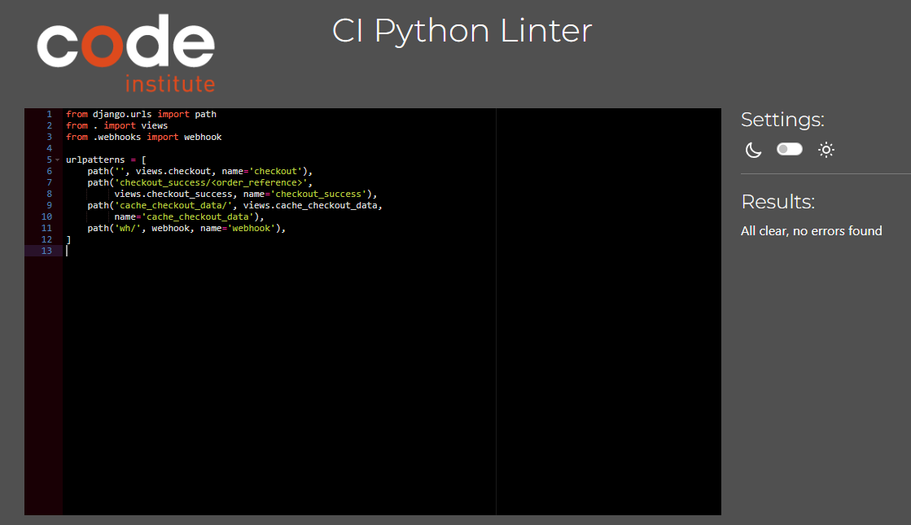

# Testing

This is the TESTING file for the [grizk](https://ecommerce-grizk-2f04b3042fc5.herokuapp.com/) website.

Return back to the [README.md](README.md) file.

## Testing Contents  
  
- [Testing](#testing)
  - [Testing Contents](#testing-contents)
  - [Validation](#validation)
    - [HTML Validation](#html-validation)
    - [JavaScript Validation](#javascript-validation)
    - [Python Validation](#python-validation)
    - [CSS Validation](#css-validation)
    - [Lighthouse Scores](#lighthouse-scores)
    - [Wave Accessibility Score](#wave-accessibility-score)
  - [Manual Testing](#manual-testing)
    - [User Input/Form Validation](#user-inputform-validation)
    - [Browser Compatibility](#browser-compatibility)
    - [Responsiveness](#responsiveness)
    - [User Stories Testing](#user-stories-testing)

## Validation

### `HTML Validation`

For my HTML files I have used [HTML W3C Validator](https://validator.w3.org) to validate all of my HTML files.

I have had to follow a different approach for validating my HTML for this project as the majority of my pages are developed using Jinja syntax such as '' and '{{ form|crispy }}' and most require user authentication. The HTML validator will throw errors if I were to use my website's URL so I have had to follow the below approach for every page:

- Via the deployed Heroku app link, I have navigated to each individual page.
- Right clicking on the screen/CTRL+U/⌘+U on Mac, allows a menu to appear, giving me the option to 'View page source'.
- The complete HTML code for the deployed page will appear, allowing you to select the entire code using CTRL+A/⌘+A on Mac.
- Paste the copied code into the [validate by input](https://validator.w3.org/#validate_by_input) option.
- Check for errors and warnings, fix any issues, revalidate by following the above steps and record the results.

 

All HTML pages were validated and received a 'No errors or warning to show' for code that I had written, result as shown above.

| HTML Source Code/Page | Errors | Warnings | Status |
| ---- | ------ | -------- | -------- |
| `Home` | None | None | Passed |
|`Log In` | None | None | Passed |
| `Log Out` | None | None | Passed |
| `Register` | 4 | 0 | During the development of Grizk, several template rendering issues were encountered, particularly involving the integration with Django Allauth. Errors such as unclosed  elements, stray tags, and incorrectly structured help text were identified. These issues primarily resulted from how form fields and help texts were being rendered in custom templates.   | 
| `Account` | None | None | Passed | 
| `Wishlist` | None | None | Passed |
| `Admin Dashboard` | None | None | Passed | 
| `Admin Blog List` | None | None | Passed |
| `Admin Add Blog` | None | None | Passed | 
| `Admin Edit Blog` | None | None | Passed |
| `Admin Product List` | None | None | Passed |
| `Admin Product Detail` | None | None | Passed |
| `Admin Add Product` | None | None | Passed |
| `Admin Edit Product` | None | None | Passed |
| `Admin Delete Product` | None | None | Passed |
| `All Products` | None | None | Passed |
| `User Blog List` |None | None | Passed |
| `Cart - Empty` | None | None | Passed | 
| `Checkout` | None | None | Passed |
| `Checkout-success` | None | None | Passed |
| `Blog` | None | None | Passed |
| `Profile/Account` | None | None | Passed |
| `Order History` | None | None | Passed |
| `Wishlist` | None | None | Passed |
| `Forgot Password` | None | None | Passed |
| `Error 403` | None | None | Passed |
| `Error 404` | None | None | Passed |
| `Error 500` | None | None | Passed |

### `JavaScript Validation`

[JSHint](https://jshint.com/) was used to validate the JavaScript code implemented in the Grizk platform. External JS files utilized for Bootstrap, jQuery, and FontAwesome were excluded from this validation process to focus on custom scripts developed for the project.

| Page | Screenshot | Errors | 
| ---- | ---------- | ------ | 
|` Home`  |  | none | 
| `Base Script` |  | none | 
| `Cart - Quantity Script` |  | none | 
| `Stripe Payment Integration` |  | none | 
| `Products Filtering Script` |  | none | 
| `CountryField JS` |  | none | 

### `Python Validation`

The [CI Python Linter](https://pep8ci.herokuapp.com/#) was used to validate all Python files created and edited within the project. No issues were detected, and all line lengths were verified to conform to PEP8 standards. Below is a table summarizing the validation results, accompanied by screenshots showing the successful validation of each component. Entries marked as "Not applicable" indicate that no Python files were relevant or created for that feature.

| Feature   | admin  | forms  | models  | urls  | views  | App  |
|-----------|--------|--------|---------|-------|--------|---------|
| **Blog**      | Not applicable |  |  |  |  |  |
| **Cart**      | Not applicable | Not applicable | Not applicable |  |  | Context  |
| **Checkout**  |  |  |  |  |  |  |
| **Home**      | Not applicable | Not applicable | Not applicable |  |  |  |
| **Products**  |  |  |  |  |  |  |
| **Profiles**  | Not applicable |  |  |  |  | App  |
| **Wishlist**  |  | Not applicable | Not applicable |  |  |  |

### `CSS Validation`

[W3C CSS Validator](https://jigsaw.w3.org/css-validator/) was used to validate my CSS files. External CSS for Bootstrap, provided by [CDN](https://cdn.jsdelivr.net/npm/bootstrap@4.6.2/dist/css/bootstrap.min.css) was not tested.

To keep my document concise I have not included every screenshot of the CSS validations, as they are all the same, but the results are as follows.

| CSS File | Errors | Warnings |
| ---- | ------ | -------- |
| `Checkout` | None | None |
| `Profiles/Accounts` | None | None |
| `Base CSS` | None | None |

### `Lighthouse Scores`

Lighthouse testing was carried out in Incognito mode to achieve the best result.

| Page | Lighthouse Scores - Desktop | Mobile |
| ---- | ----------------- | -------- |
| `Home` |      |        |
| `Products`  |    |          |
| `Blog list`  |    |    |
| `Profile` |               |     |
| `Cart` |     |     |

### `User Input/Form Validation`

Testing was carried out on desktop using a Chrome browser to ensure all forms take the intended input and process the input appropriately.

| Feature                    | Tested?  | User Input Required | User Feedback Provided     | Pass/Fail | Fix |
|----------------------------|----------|---------------------|----------------------------|-----------|-----|
| Navbar Logo and Icons      | Yes      | Click Links bring user to correct destination    | Redirects to home page | Pass | N/A |
| Home Page                  | Yes      | Hover/Click interactive features | Carousel moves | Pass | N/A |
| Register Page              | Yes      | Text Input/Click Links | Form field highlight/Toast message | Pass | N/A |
| Email Validate             | Yes      | Click Links | Toast message | Pass | N/A |
| Forgot Password             | Yes     | Text Input/Click Links | Form field highlight/Toast message | Pass | N/A |
| Log In Page                | Yes      | Text Input/Click Links | Form field highlight/Toast message | Pass | N/A |
| Log Out Page               | Yes      | Click Links bring user to correct destination | Toast message | Pass | N/A |
| Account - Edit Address     | Yes      | Text Input/Click to Save | Form field highlight/Toast message | Pass | N/A |
| Search                     | Yes      | Text Input/Click to Search | Form field highlight | Pass | N/A |
| Newsletter Sign Up         | Yes      | Text Input/ Click to Subscribe | New tab subscription confirmation | Pass | N/A |
| Admin Dashboard            | Yes      | Click Links brings user to correct URL | Button animation on hover | Pass | N/A |
| Products                   | Yes      | Click product brings user to product description | Pointer change on hover of products | Pass | N/A |
| Add Product                | Yes      | Navigated to Admin Dashboard, clicked 'Add Product', Completed form, Form submits correctly to display the product. | Form field highlight/Toast message, new product uploaded. | Pass | N/A |
| Edit Product               | Yes      | Navigated to Admin Dashboard, clicked 'Edit Product', Completed form, Form submits correctly to display the edited product. | Form field highlight/Toast message, product updated. | Pass | N/a |
| View Blog               | Yes      | Click link for article | Blog card imgae enlarges on hover | Pass | N/A |
| Add Blog                | Yes      | Navigated to Admin Dashboard, clicked 'Add blog', Completed form, Form submits correctly to display the blog. | Form field highlight/Button animation/Toast message, new article uploaded. | Pass | N/A |
| Edit Blog               | Yes      | Navigated to Admin Dashboard, clicked 'Edit Blog', Completed form, Form submits correctly to display the edited article. | Form field highlight/Button animation/Toast message, Blog edited and uploaded. | Pass | N/A |
| Product Quantity           | Yes      | Click increment/decrement | Colour change on hover/product quantity successfully changed | Pass | N/A |
| Checkout                   | Yes      | Click 'Secure Checkout', correct products in bag, entered delivery and payment details, submitted form to process payment. | Form field highlight/Button animation/Toast message, Loading spinner when processing order, order processed saved to account and email sent. | Pass | N/A |

### `Browser Compatibility`

Grizk was tested on the following browsers, purchases were made, Blogs/products added/edited/deleted, error pages, all features were accessible and working as intended:

- Chrome 
- Firefox 
- Edge 
- Safari

| Browser | Issue | Functionality |
|---------|-------|---------------|
| Firefox | None  | All Intact    |
| Edge (Main browser used in development)   | None  | All Intact    |
| Safari | None | All Intact  |
| Chrome  | None | All Intact |

### `Responsiveness`

Using the Bootstrap framework enabled a faster and more efficient development process for creating a responsive website. Grizk was designed with a mobile-first approach to ensure a seamless, positive shopping experience across all devices. Throughout development, regular testing was conducted using Dev Tools to verify display consistency on various devices, including iPhone models (from iPhone 4 to iPhone 12), Samsung Galaxy S20, iPad/iPad Pro, and laptop/desktop screens. After deployment to Heroku, Grizk was tested on actual devices to validate the user experience in real-world conditions.

No major issues were found during these tests. Minor adjustments were made to the checkout view to hide product images on smaller screens, allowing only essential product information to be displayed, thus maintaining clarity and usability. Thanks to Bootstrap's flexible grid system, there were no significant differences between desktop and tablet views, ensuring a consistent interface across different devices. Below is a selection of screenshots illustrating how Grizk adapts to various screen sizes.

  
*Grizk Desktop/Mobile Home Responsive Views*

  
*Grizk Desktop/Mobile Products Responsive Views*

  
*Grizk Desktop/Mobile Blog Responsive Views*

  
*Grizk Desktop/Mobile Cart Responsive Views*

### `User Stories Testing`

| **Test Case ID** | **Module**      | **User Story**                                                                                                                                 | **Test Steps**                                                                                                                                                                                                                                                                                                                | **Expected Result**                                                                                                                                                                                                        | **Status** |
|------------------|-----------------|------------------------------------------------------------------------------------------------------------------------------------------------|-------------------------------------------------------------------------------------------------------------------------------------------------------------------------------------------------------------------------------------------------------------------------------------------------------------------------------|----------------------------------------------------------------------------------------------------------------------------------------------------------------------------------------------------------------------------|------------|
| TC001            | User Auth       | As a **new user**, I can **register an account** so that I can **access features reserved for registered users**.                              | 1. Navigate to the registration page.  2. Fill out the registration form with valid details.  3. Click 'Register'.                                                                                                                                                                                                      | User account is successfully created, and a confirmation message is displayed. User is redirected to the login page.                                                                                                                                              | Pass       |
| TC002            | User Auth       | As an **existing user**, I can **log in to my account** so that I can **access my saved data and features**.                                  | 1. Navigate to the login page.  2. Enter valid username and password.  3. Click 'Login'.                                                                                                                                                                                                                                | User is successfully logged in and redirected to the home page.                                                                                                                                                                                                   | Pass       |
| TC003            | User Auth       | As a **user**, I can **reset my password** if I forget it, so that I can **recover my account**.                                               | 1. Navigate to the login page.  2. Click 'Forgot Password?'.  3. Enter registered email and submit.  4. Check email inbox and click the reset link.  5. Enter a new password and confirm.                                                                                                                         | Password is successfully reset, and user can log in with the new password.                                                                                                                                                                                        | Pass       |
| TC004            | Profile         | As a **user**, I can **update my profile details** so that I can **keep my information up-to-date**.                                          | 1. Navigate to 'My Profile'.  2. Click 'Edit Profile'.  3. Update details and save.                                                                                                                                                                                                                                    | Profile details are updated, and a confirmation message is shown.                                                                                                                                                                                                 | Pass       |
| TC005            | Product Browsing| As a **visitor**, I can **browse products by category** so that I can **find products I’m interested in**.                                   | 1. Navigate to the home page.  2. Click on a category from the menu (e.g., Laptops, Gaming PCs).                                                                                                                                                                                                                            | Products from the selected category are displayed.                                                                                                                                                                                                               | Pass       |
| TC006            | Product Browsing| As a **visitor**, I can **search for products** by name or keyword so that I can **easily find specific items**.                              | 1. Enter a keyword in the search bar.  2. Click 'Search'.                                                                                                                                                                                                                                                                  | Relevant products matching the search term are displayed.                                                                                                                                                                                                       | Pass       |
| TC007            | Cart Management | As a **customer**, I can **add products to my cart** so that I can **purchase them**.                                                        | 1. Browse or search for a product.  2. Click 'Add to Cart'.                                                                                                                                                                                                                                                                | The product is added to the cart, and a confirmation message is shown.                                                                                                                                                                                            | Pass       |
| TC008            | Cart Management | As a **customer**, I can **view my cart** so that I can **see the products I intend to purchase**.                                           | 1. Click the cart icon.                                                                                                                                                                                                                                                                                                       | A detailed view of the cart is shown, displaying all added products, quantities, and total cost.                                                                                                                                                                | Pass       |
| TC009            | Cart Management | As a **customer**, I can **remove products from my cart** so that I can **modify my purchase list**.                                         | 1. Open the cart.  2. Click 'Remove' next to a product.                                                                                                                                                                                                                                                                    | The selected product is removed from the cart, and the updated total is displayed.                                                                                                                                                                               | Pass       |
| TC010            | Checkout        | As a **customer**, I can **proceed to checkout** so that I can **finalize my purchase**.                                                     | 1. Open the cart.  2. Click 'Proceed to Checkout'.  3. Enter delivery and payment details.  4. Confirm order.                                                                                                                                                                                                      | The order is successfully placed, and an order summary is displayed. An email confirmation is sent to the user.                                                                                                                                                  | Pass       |
| TC011            | Wishlist        | As a **customer**, I can **add products to my wishlist** so that I can **save them for future purchase**.                                    | 1. Browse or search for a product.  2. Click 'Add to Wishlist'.                                                                                                                                                                                                                                                            | The product is added to the wishlist, and a confirmation message is displayed.                                                                                                                                                                                   | Pass       |
| TC012            | Wishlist        | As a **customer**, I can **view my wishlist** so that I can **see products I plan to purchase later**.                                       | 1. Click on the wishlist icon.                                                                                                                                                                                                                                                                                               | The wishlist page shows all saved products.                                                                                                                                                                                                                      | Pass       |
| TC013            | Blog            | As a **customer**, I can **view blog articles** so that I can **learn more about tech products and updates**.                                | 1. Navigate to the 'Blog' section.                                                                                                                                                                                                                                                                                           | All available blog articles are displayed. Clicking on an article opens the full content.                                                                                                                                                                        | Pass       |
| TC014            | Admin           | As an **admin**, I can **add new products** so that **customers can see new arrivals**.                                                      | 1. Log in as admin.  2. Navigate to the 'Product Dashboard'.  3. Click 'Add Product' and fill out the form.  4. Submit.                                                                                                                                                                                             | The new product is added, and a confirmation message is shown.                                                                                                                                                                                                   | Pass       |
| TC015            | Admin           | As an **admin**, I can **edit existing products** so that I can **update information or prices**.                                            | 1. Log in as admin.  2. Navigate to the 'Product Dashboard'.  3. Click 'Edit' next to a product.  4. Make changes and save.                                                                                                                                                                                         | Product information is updated, and a confirmation message is displayed.                                                                                                                                                                                         | Pass       |
| TC016            | Admin           | As an **admin**, I can **view all placed orders** so that I can **track and manage them**.                                                   | 1. Log in as admin.  2. Navigate to the 'Order Management' page.                                                                                                                                                                                                                                                           | All orders are listed with details like order number, customer name, and order status.                                                                                                                                                                          | Pass       |
| TC017            | Admin           | As an **admin**, I can **approve or reject reviews** so that I can **moderate the content on the platform**.                                 | 1. Log in as admin.  2. Navigate to the 'Reviews' section.  3. Approve or reject a review.                                                                                                                                                                                                                              | The review status is updated accordingly.                                                                                                                                                                                                                        | Pass       |
| TC018            | Admin           | As an **admin**, I can **view and edit blog articles** so that I can **keep the content current**.                                           | 1. Log in as admin.  2. Navigate to the 'Blog Dashboard'.  3. Click 'Edit' next to an article.  4. Make edits and save.                                                                                                                                                                                             | The blog article is updated successfully, and a confirmation message is shown.                                                                                                                                                                                   | Pass       |
| TC019            | Admin           | As an **admin**, I can **manage user accounts** so that I can **maintain control over user access**.                                         | 1. Log in as admin.  2. Navigate to 'User Management'.  3. Update user roles, or deactivate accounts as needed.                                                                                                                                                                                                        | User account is updated, and a confirmation message is displayed.                                                                                                                                                                                                | Pass       |
| TC020            | Newsletter      | As a **customer**, I can **subscribe to the Grizk newsletter** so that I can **receive updates on the latest tech gadgets, sales, and offers**. | 1. Scroll to the footer of the home page.  2. Enter an email address in the subscription form.  3. Click 'Subscribe'.                                                                                                                                                                                                  | A success message confirms that the user is subscribed to the newsletter.                                                                                                                                                                                        | Pass       |
| TC021            | General         | As a **user**, I can **navigate the site on mobile devices** so that I can **have a smooth experience across all platforms**.                | 1. Open the website on a mobile browser.  2. Navigate through all sections, including home, products, blog, profile, and cart.                                                                                                                                                                                             | The website is fully responsive and all features work seamlessly on mobile.                                                                                                                                                                                      | Pass       |

